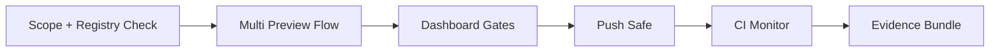

# Pilot-for-Pilot Control Plane Contract (Ultimate UX)

This document defines the implementation contract for running Arqon Pilot on Arqon Pilot with one-click orchestration, rich visualization, strict safety controls, and deterministic evidence.

Scope: **post-commit flow** (after coding + git commit), executed primarily from the Control Panel.

---

## Implementation Status

1. Phase A: Complete (Dashboard one-click Post-Commit routine with remediation actions).
2. Phase B: Complete (timeline/log visual execution with human-readable summaries).
3. Phase C: Complete (policy-driven routine via `operator_routine.post_commit_profile`).
4. Phase D: Complete (Release Routine card: readiness/compat/migration/publish/evidence/verify + readiness score).

Hard-close evidence for this contract must be linked in `docs/release-log.md`.

---

## 1) Product Intent

Build an operator experience where the user can:

1. Launch one routine and see the full pipeline progress visually.
2. Trust that unsafe operations are blocked by policy before mutation.
3. Understand failures without reading raw JSON.
4. Recover quickly using actionable remediation and replay evidence.

Non-goal: replacing git commit authoring inside IDE. Commit authoring remains in editor.

---

## 2) Canonical Flow (Post-Commit)

### 2.1 Pipeline Stages



### 2.2 Stage Mapping (UI -> Script/Command)

1. Scope + Registry Check
   - UI: AGOrg active scope + AGO registry validation
   - Backing: `/api/agorg/*`, `/api/multi/registry_stats`
2. Multi Preview Flow
   - UI: `List -> Status -> Order -> DAG -> PR Plan`
   - Backing: `pilot.multi.list|status|order|dag|prs.create (dry_run)`
3. Dashboard Gates
   - UI: `Policy -> Hook Policy -> Drift -> Gate`
   - Backing: `run_preflight_graph` steps / dependency actions
4. Push Safe
   - UI: Push button in Dashboard
   - Backing: `scripts/push_main.sh` parity behavior
5. CI Monitor
   - UI: workflow status panel
   - Backing: workflow run polling/event bridge
6. Evidence Bundle
   - UI: Export Evidence
   - Backing: `scripts/release_collect_evidence.sh` parity behavior

---

## 3) Ultimate Visualization Spec

## 3.1 Command Deck (Top Banner)

Render as a horizontal pipeline with 6 chips:

1. `Scope`
2. `Multi Preview`
3. `Gates`
4. `Push`
5. `CI`
6. `Evidence`

Each chip supports states:

1. `idle` (neutral)
2. `running` (animated gradient)
3. `pass` (green)
4. `warn` (amber)
5. `fail` (red)
6. `blocked` (purple/locked)

Clicking a chip focuses the corresponding stage card.

## 3.2 Stage Cards

Each stage card must include:

1. Human summary (plain English, no JSON required)
2. Key metrics table
3. Action buttons
4. “View JSON” toggle (collapsed by default)
5. “Copy Summary” and “Copy JSON” controls

## 3.3 Multi Preview Visual

Replace plain text-only output with:

1. **Repo Cohort Table**
   - columns: repo, branch, clean, ahead, behind, selected
2. **Dependency DAG Panel**
   - nodes by repo
   - edges by declared dependency
   - stage bands (Stage 1, Stage 2, ...)
3. **PR Plan Panel**
   - ordered PR list: head -> base per repo
   - “0 repos matched” shown as hard warning with remediation

---

## 4) Safety + Security Contract

## 4.1 Mutation Guardrails

1. Preview-first:
   - all mutating flows require preview success before execute button is enabled
2. Scope guard:
   - active AGOrg required
   - current repo must be in active AGOrg boundaries
3. Selector guard:
   - group/tags must resolve at least one repo for multi actions
4. Protected branch guard:
   - destructive or direct-protected mutations require typed confirmation

## 4.2 Policy Enforcement Layers

1. Runtime policy checks (settings policies)
2. Hook policy checks
3. Drift checks
4. Gate check
5. Push-safe discipline gate

Any hard-fail blocks downstream stage transitions.

## 4.3 Evidence Integrity

1. Every stage emits `operation_id`
2. Stage output carries `artifact_path` when available
3. Final bundle verification must provide pass/fail taxonomy:
   - `missing_file`
   - `hash_mismatch`
   - `parse_error`
   - `chain_mismatch`
   - `schema_error`

---

## 5) Accessibility + Zero-Doc UX Contract

1. All stage/state changes announced via `aria-live`
2. Keyboard-first:
   - full operation via Tab/Enter/Space
3. Focus choreography:
   - when stage completes, focus moves to summary header for screen-reader context
4. Error messaging:
   - plain language + exact next step
   - no raw stack traces as primary output
5. JSON always optional:
   - default view is structured summary

---

## 6) Performance + Reliability Targets

1. Stage status update latency: <= 250ms per UI refresh cycle
2. Multi preview (<=20 repos): <= 3s target
3. DAG render: <= 500ms target after data arrival
4. Pipeline should degrade gracefully if bus is down:
   - display deterministic fallback mode + retry guidance
5. No silent “success with zero work” for critical stages

---

## 7) Data Contracts (UI Output)

All stage actions return envelope:

```json
{
  "ok": true,
  "operation_id": "uuid",
  "stage": "preview|execute|verify",
  "status": "ok|warn|error|blocked",
  "summary": "human-readable summary",
  "artifact_path": "/abs/path/or/null",
  "details": {}
}
```

`summary` must always be present and human-readable.

---

## 8) Implementation Phases

## Phase A: One-Click Post-Commit Routine (Now)

1. Add `Run Post-Commit Routine` button in Dashboard.
2. Wire pipeline state chips with real-time status.
3. Run canonical flow with stage-by-stage summaries.
4. Stop on hard fail with remediation CTA.

Definition of done (A):

1. Operator completes full routine without terminal.
2. No raw JSON required to understand outcomes.
3. Failure in any stage blocks next stage and is clearly explained.

## Phase B: Deep Visuals

1. Enhanced DAG canvas with stage layers and edge highlighting.
2. Repo cohort heatmap (dirty/ahead/behind).
3. PR plan timeline with copy/share actions.

## Phase C: Governance-Driven Orchestration

1. Routine behavior controlled by policy objects (not hardcoded steps).
2. Editable routine profiles per AGOrg.
3. Preview-diff for policy changes before activation.

## Phase D: Release Mode

1. “Release Routine” variant including tag/publish/verify/evidence steps.
2. Release checklist view with required artifacts.
3. Final release readiness score + signed evidence summary.

Implemented:

1. Dashboard **Release Routine (Phase D)** card executes:
   - `release-readiness`
   - `release-compat-matrix`
   - `release-migration-smoke`
   - `prepush-gate`
   - optional `push` (publish toggle)
   - `release-collect-evidence`
   - `release-verify-bundle`
   - signed evidence export (`/api/evidence/export`)
2. Checklist output is human-readable by default (JSON remains secondary in existing action panels).
3. Readiness score is computed from required step pass ratio and displayed as a chip.

---

## 9) Hard-Close Test Matrix

For each phase, run:

1. Unit tests for orchestration state reducer + guard predicates
2. Integration tests for API stage transitions and blocking behavior
3. E2E tests for full post-commit routine on Pilot AGO
4. Regression tests for known gotchas:
   - selector resolves 0 repos
   - stale scope
   - bus fallback mode
   - evidence verification mismatch
5. Accessibility checks:
   - keyboard-only completion
   - screen-reader announcements on stage transitions

No phase is hard-closed without evidence paths linked in `docs/release-log.md`.

---

## 10) Known Gotcha Alignment

Must actively defend against:

1. G-015 (UI JS syntax break)
2. G-043 (artifact write failures)
3. G-044 (repo boundary/scope drift)
4. G-045 (discipline gate pre-push failures)

---

## 11) Next Immediate Build Order

1. Implement Phase A pipeline card + state chips.
2. Implement structured stage summaries (default view), JSON as secondary.
3. Add stage-stop + remediation actions.
4. Add tests + update runbook/tutorial with exact usage.
