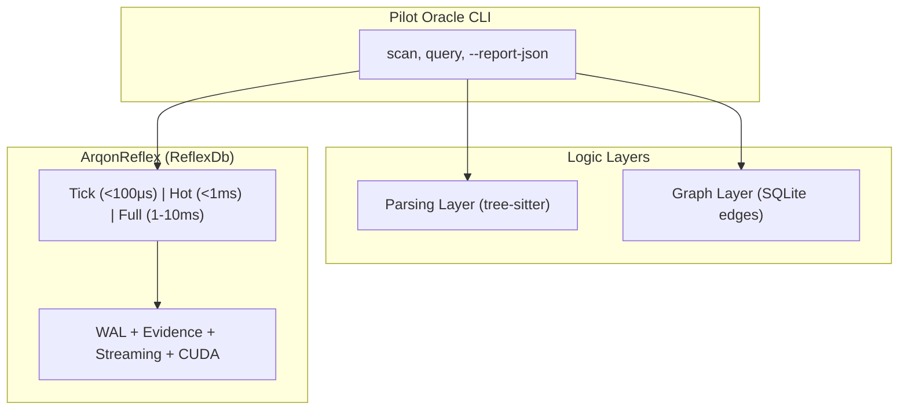

# Pilot Oracle vs ArqonReflex: Comparative Analysis
## Executive Summary
**Verdict: ArqonReflex should power Pilot's Oracle.**

Pilot's current Oracle is a functional prototype. ArqonReflex is a battle-tested, production-grade retrieval engine purpose-built for the exact use case Oracle needs. Using Reflex would be like replacing a bicycle with a jet engine.

## Architecture Comparison
| Dimension | Pilot Oracle | ArqonReflex |
| :--- | :--- | :--- |
| **Codebase** | ~32KB, 12 files | ~370KB, 25+ files + 10 crates |
| **Vector Store** | LanceDB (external dep) | Custom engine (zero external vector deps) |
| **Embedding** | MiniLM (384-dim, CPU) | MiniLM compatible + CUDA support |
| **Graph DB** | SQLite | Custom B2 Relational Atlas |
| **Query Pipeline** | embed → search → enrich | 3-lane system (Tick/Hot/Full) |
| **Durability** | None (rebuild on crash) | WAL + checkpoint + crash recovery |
| **Concurrency** | Single-threaded | Send + Sync, lock-free reads |
| **Latency** | ~50-500ms (LanceDB overhead) | 784μs @ 1M docs (proven) |

## What Reflex Has That Oracle Doesn't

### 1. Three Query Lanes
| Lane | Latency | Use Case |
| :--- | :--- | :--- |
| **Tick** | <100μs | Real-time token-by-token retrieval |
| **Hot** | <1ms | Interactive agent queries |
| **Full** | 1-10ms | Comprehensive deep search |

Oracle has one mode: "Full." There is no fast path.

### 2. Evidence Resolution (1,279 lines)
- Weighted conflict resolution with temporal validity
- Support/Refute stance detection
- Source credibility and recency weighting
- **Verdicts:** Unanimous, Majority, Conflicting, Ambiguous, NotEnoughEvidence

Oracle returns similarity scores. Reflex returns judgments.

### 3. Streaming Token Coordinator (1,141 lines)
- Mid-word token buffering (`Par` + `is` → `Paris`)
- UTF-8 boundary safety
- Pending intervention queue for safe-boundary corrections

Oracle has no streaming awareness.

### 4. Curiosity Engine (Self-Diagnosis)
- Scans the B2 graph for "loose regions" (high cycle inconsistency)
- Generates `AtlasHealthReport` with integrity scores
- **Status classification:** Healthy > Drifting > Fractured

Oracle has no self-monitoring.

### 5. Multi-Hop Dependency Tracking
- Zero-allocation, ASCII-only backref detection
- `RecentClaimsIndex` with O(1) insert/lookup (open addressing)
- Entity hash chains for cross-sentence reasoning

### 6. Additional Capabilities
- **WAL:** Write-ahead log for crash recovery
- **Rate Limiter:** Bounded query pressure (31KB of logic)
- **Sentinel Guard:** ArqonSentinel integration for safety
- **Entity Matching:** Name normalization, nickname dictionaries, diatrics removal
- **Background Services:** Health monitoring, compaction
- **CUDA Crate:** GPU-accelerated similarity computation
- **ArqonHPO Integration:** Self-tuning under drift

## The Case for Reflex as Oracle's Engine

### What Oracle Does Well
- Tree-sitter parsing for code structure extraction
- Graph database for code relationships (function→function, module→module)
- CLI integration with Pilot's command system

### What Oracle Should Keep
- The parsing layer (`parser.rs`, `parser_py.rs`, tree-sitter)
- The graph schema (`schema.rs`, `edges.rs`)
- The CLI/API surface (`query.rs` command interface)

### What Should Be Replaced With Reflex
- **Vector storage:** LanceDB → `ReflexDb` (faster, durable, multi-lane)
- **Embedding pipeline:** Direct MiniLM → Reflex's optimized batch insert
- **Search:** LanceDB vector search → Reflex 3-lane query system
- **Evidence quality:** Raw scores → `EvidencePacket` with confidence signals

## Proposed Integration Architecture

## Migration Effort Estimate

| Task | Effort | Risk |
| :--- | :--- | :--- |
| Add `arqon_reflex` as dependency | Low | Low |
| Replace `VectorStore` with `ReflexDb` | Medium | Low |
| Adapt `embed.rs` to use Reflex's insert API | Low | Low |
| Replace `query.rs` search with Reflex lanes | Medium | Low |
| Add evidence-aware results to CLI output | Medium | Low |
| Remove LanceDB dependency | Low | Low |
| **Total** | **~2-3 sessions** | **Low** |

## Risks

> [!WARNING]
> Reflex currently targets document/text embeddings. Oracle's embeddings are code symbols (function signatures, docstrings). Verify that Reflex's similarity metrics perform well on code-specific embeddings before fully migrating.

> [!NOTE]
> The Reflex crate uses edition = "2021" which matches Pilot's core lane policy (Rust 1.82.0). No toolchain conflict.

## Bottom Line
Pilot Oracle is a proof of concept. ArqonReflex is a production engine that already exists in your ecosystem. Using Reflex to power Oracle would:

1.  Eliminate ~32KB of prototype vector/embedding code
2.  Gain sub-millisecond retrieval, WAL durability, and evidence-aware results
3.  Unify the retrieval stack across the Arqon ecosystem
4.  Enable streaming-aware code intelligence (Heal integration)

The question isn't should you use Reflex—it's why haven't you already.
