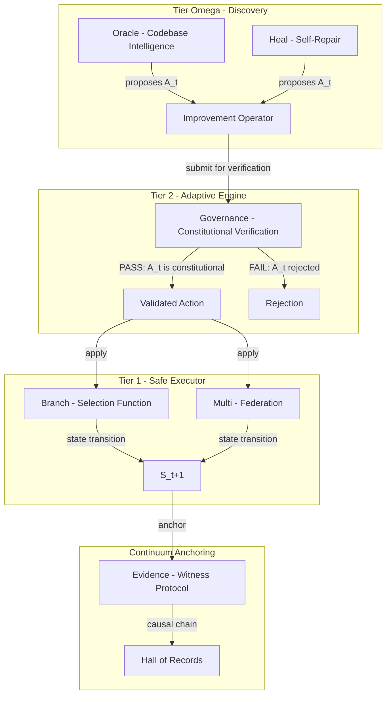
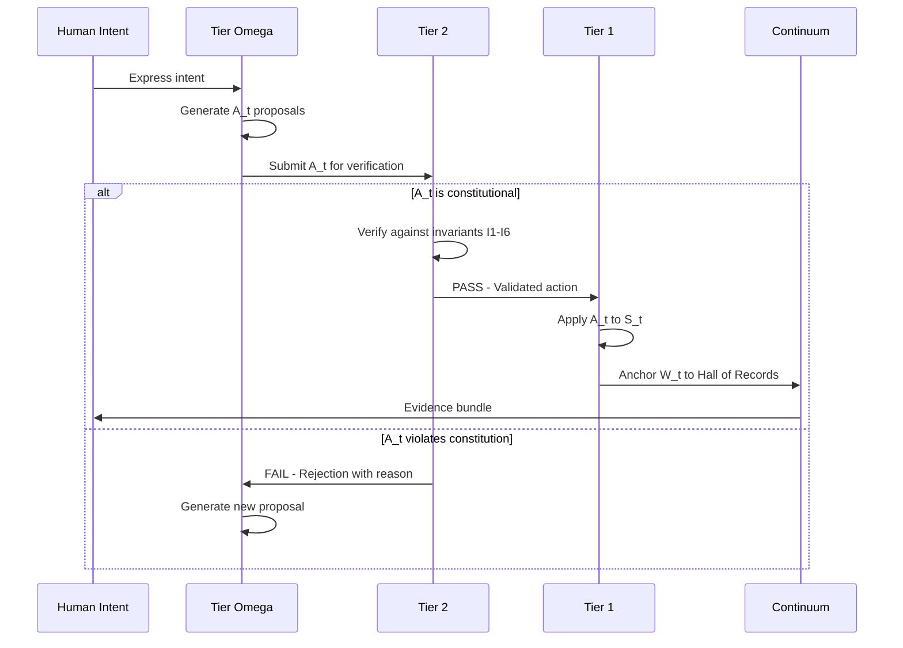
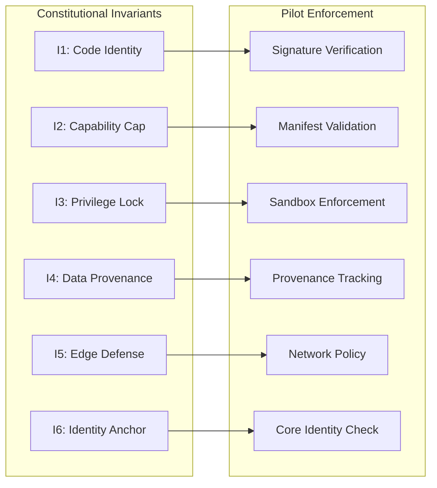
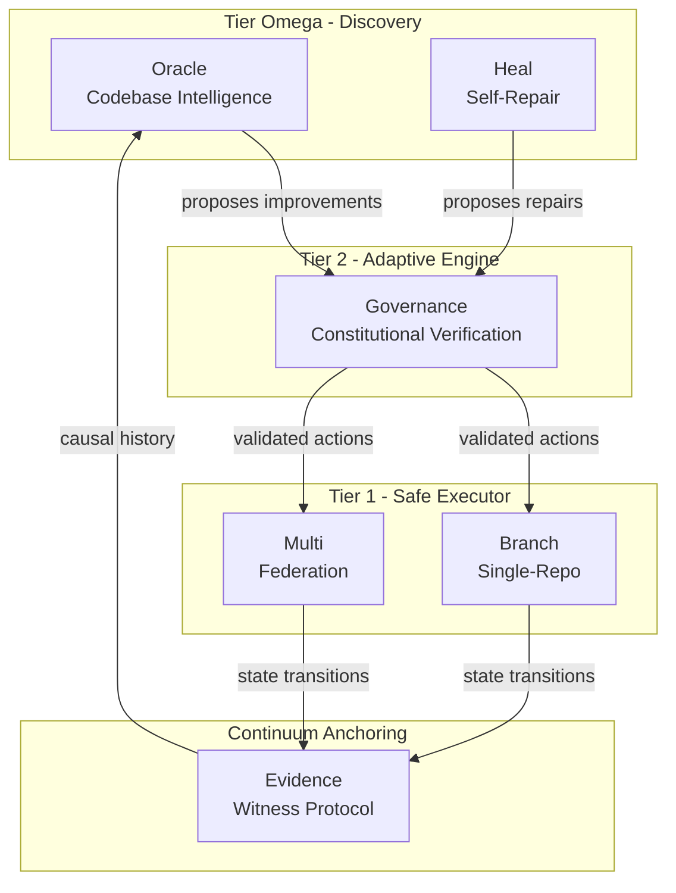

# Pilot Vision Alignment Document

**Version**: 1.0.0  
**Status**: Authoritative Context  
**Purpose**: North Star for all AI agents and developers working on Arqon Pilot

---

## Quick Reference

| Concept | Pilot IS | Pilot is NOT |
|---------|----------|--------------|
| **Identity** | The Governed RSI Engine for the Arqon Organism | Just a CI/CD tool |
| **Purpose** | The mechanism by which digital life safely modifies itself | A deployment automation system |
| **CI/CD** | The governance loop FOR RSI | The purpose of the system |
| **Preview** | Constitutional verification before state transition | Just a UX feature |
| **Evidence** | Continuum anchoring for causal history | Just logging or auditing |
| **Federation** | Organism coordination across repositories | Just multi-repo support |

### The Three Tiers at a Glance

| Tier | Name | Entropy | Role | Pilot Modules |
|------|------|---------|------|---------------|
| **Tier Ω** | Operator/Discovery | High | Generates improvements | Oracle, Heal |
| **Tier 2** | IntegriGuard/Adaptive | Zero | Verifies constitutionality | Governance |
| **Tier 1** | Executor/Safe | Selection | Applies changes | Branch, Multi |

### The SAM Loop

```
S_t → M_t → A_t → W_t → S_{t+1}
```

- **S_t**: Current system state
- **M_t**: Model/Operator logic
- **A_t**: Improvement Operator (action)
- **W_t**: Witness (evidence bundle)
- **S_{t+1}**: New system state

---

## 1. Core Identity: What Pilot IS

### The True Identity

**Pilot is the Governed RSI Engine for the Arqon Organism.**

This is not marketing language. This is ontological definition. Pilot is the mechanism by which a digital organism safely modifies itself while maintaining constitutional integrity.

### What This Means

1. **Pilot is NOT just a CI/CD tool**
   - CI/CD is the requirement, not the purpose
   - CI/CD provides the governance loop, but the purpose is RSI
   - Treating Pilot as "just CI/CD" is a category error that leads to feature drift

2. **Pilot is the self-modification mechanism**
   - When Arqon needs to change itself, it uses Pilot
   - Every command is an Improvement Operator (A_t)
   - Every execution is a state transition (S_t → S_{t+1})

3. **Pilot is the constitutional enforcement layer**
   - The preview-first discipline is not UX, it is safety
   - Policy checks are not bureaucracy, they are constitutional verification
   - Evidence bundles are not logs, they are continuum anchors

### The Identity Test

Before implementing any feature, ask:

> "Does this help Pilot fulfill its role as the Governed RSI Engine?"

If the answer is "it makes CI/CD easier" but cannot connect to RSI semantics, the feature may be drift.

---

## 2. The RSI Framework

### The SAM Loop Formalization

Pilot implements the **State-Action-Model (SAM)** loop from Recursive Self-Improvement theory:

```
┌─────────────────────────────────────────────────────────────────┐
│                        The RSI-SAM Loop                         │
├─────────────────────────────────────────────────────────────────┤
│                                                                 │
│    ┌──────────┐    ┌──────────┐    ┌──────────┐               │
│    │   S_t    │───▶│   M_t    │───▶│   A_t    │               │
│    │  State   │    │  Model   │    │  Action  │               │
│    └──────────┘    └──────────┘    └──────────┘               │
│         ▲                                │                     │
│         │                                ▼                     │
│    ┌──────────┐                   ┌──────────┐                │
│    │ S_{t+1}  │◀──────────────────│   W_t    │                │
│    │ New State│                   │ Witness  │                │
│    └──────────┘                   └──────────┘                │
│                                                                 │
└─────────────────────────────────────────────────────────────────┘
```

**Definitions:**

- **State (S_t)**: The current system snapshot—source code, runtime memory, global truth
- **Model (M_t)**: The operator's current logic, defined by S_t
- **Action (A_t)**: The Improvement Operator—a mathematically defined operation on source code or system state
- **Witness (W_t)**: Cryptographic proof of transition effectiveness—the audit trail
- **Update**: The application of A_t to S_t, producing S_{t+1}

### The Three Tiers

Pilot's architecture maps directly to the RSI governance tiers:



#### Tier Ω: Operator/Discovery (High Entropy)

**Role**: Generates improvements. High creativity, high entropy. "Allowed to be crazy."

**Modules**:
- **Oracle**: Codebase intelligence that discovers improvement opportunities
- **Heal**: Self-repair mechanisms that propose fixes

**Characteristics**:
- Proposes A_t (Improvement Operators)
- Explores solution space without constraint
- Population-based speculation supported
- Never sees verifier internal state—only PASS/FAIL signal

**Entropy**: High. This is where exploration happens.

#### Tier 2: IntegriGuard/Adaptive (Zero Entropy)

**Role**: Verifies constitutionality. Zero creativity, zero entropy. Deterministic.

**Modules**:
- **Governance**: Policy checks, constitutional verification

**Characteristics**:
- Validates A_t against Constitution
- Formal verification / strict specification / regression shield
- Rejects any A_t that violates invariants or fails tests
- The "Gap" that prevents model collapse

**Entropy**: Zero. This is where safety happens.

#### Tier 1: Executor/Safe (Selection Function)

**Role**: Applies validated changes. The selection function.

**Modules**:
- **Branch**: Single-repo state transitions
- **Multi**: Federated state transitions

**Characteristics**:
- Applies A_t → S_{t+1}
- Only executes constitutionally verified actions
- Maintains operational closure
- Produces witness evidence

**Entropy**: Selection. This is where reality happens.

### The Generator-Verifier Gap

The entity generating code (M_t) must be mathematically distinct from the entity verifying it (V).

```
┌─────────────────────────────────────────────────────────────────┐
│                  The Generator-Verifier Gap                     │
├─────────────────────────────────────────────────────────────────┤
│                                                                 │
│  ┌──────────────┐              ┌──────────────┐                │
│  │  Generator   │              │   Verifier   │                │
│  │  Tier Ω      │              │   Tier 2     │                │
│  │              │              │              │                │
│  │ High Entropy │    GAP       │ Zero Entropy │                │
│  │ "Crazy"      │ ◀─────────▶  │ Deterministic│                │
│  │ Creative     │              │ Absolute     │                │
│  └──────────────┘              └──────────────┘                │
│         │                              │                        │
│         │      ┌──────────────┐        │                        │
│         └─────▶│   PASS/FAIL  │◀───────┘                        │
│                │   Binary     │                                 │
│                │   Signal     │                                 │
│                └──────────────┘                                 │
│                                                                 │
│  The Generator NEVER sees Verifier internal state.              │
│  This forces alignment with external, objective reality.        │
│                                                                 │
└─────────────────────────────────────────────────────────────────┘
```

**Why This Matters**:
- Prevents model collapse (the Entropy Wall)
- Forces grounding in external reality (compiler, tests, constitution)
- The generator cannot drift into subjective fantasy
- Arqon is not a neural network dreaming in a vacuum—it is wired to a compiler

---

## 3. CI/CD as Governance Loop

### The Critical Distinction

**CI/CD is the governance loop FOR RSI, not the purpose of Pilot.**

This distinction is foundational. Getting it wrong leads to:
- Feature drift toward "just another CI/CD tool"
- Loss of RSI semantics in code and documentation
- Disconnect between governance and constitutional enforcement

### The Mapping

| CI/CD Concept | RSI Concept | Pilot Implementation |
|---------------|-------------|----------------------|
| **Command** | Improvement Operator (A_t) | `pilot branch`, `pilot multi` |
| **Policy Check** | Constitutional Verification | Governance module, Tier 2 |
| **Evidence Bundle** | Continuum Anchor | Witness protocol, W_t |
| **Execute** | State Transition (S_t → S_{t+1}) | Tier 1 execution |
| **Preview** | Constitutional Pre-verification | Preview-first discipline |
| **Replay** | Causal Chain Traversal | Evidence integrity verification |

### The Governance Loop Flow



### Why This Mapping Matters

1. **Every command is an Improvement Operator**
   - Not "running a script" but "proposing a state transition"
   - The language we use shapes the system we build

2. **Policy checks are constitutional verification**
   - Not "bureaucracy" but "safety enforcement"
   - The constitution is compiled into the runtime

3. **Evidence is continuum anchoring**
   - Not "logging" but "causal history preservation"
   - Truth is a conserved quantity

---

## 4. The Six Constitutional Invariants

### Overview

Arqon enforces six unbreakable laws that define what states are possible. These are not rules that can be bypassed—they are mathematical impossibilities. The system literally cannot represent certain states.

| ID | Invariant | Metaphor | Enforcement | Consequence |
|----|-----------|----------|-------------|-------------|
| **I1** | Code Identity | DNA—you ARE your signature | Cryptographic Signatures | Execution Reject |
| **I2** | Capability Cap | Species—you can't do what you don't have organs for | Static Manifest Whitelist | Tool Invisibility |
| **I3** | Privilege Lock | Immune system—no foreign cells | Kernel Namespace Sandbox | Process Kill |
| **I4** | Data Provenance | Memory—you know where knowledge came from | Merkle Anchor Logs | Write Rejection |
| **I5** | Edge Defense | Skin—the boundary of self | Network Topology Lock | Ingress/Egress Block |
| **I6** | Identity Anchor | Soul—the irreducible core | RLM Bitwise Filter | System Reset |

### How Pilot Enforces the Invariants



### Constitutive vs. Regulative Safety

**Regulative Safety** (Traditional):
- Rules that say "do not do X"
- Can be bypassed with clever workarounds
- Probabilistic enforcement
- ~85% safety assurance

**Constitutive Safety** (Arqon):
- Physics that make X impossible
- Cannot be bypassed because the state cannot be represented
- Mathematical enforcement
- 100% safety assurance (Grade S Certification)

**Pilot's Role**:
- Pilot implements constitutive safety through the preview-first discipline
- Forbidden states are made unrepresentable before execution
- The system does not "choose" to follow rules—it cannot violate them

### Making Forbidden States Unrepresentable

```
┌─────────────────────────────────────────────────────────────────┐
│           Constitutive Safety in Pilot                          │
├─────────────────────────────────────────────────────────────────┤
│                                                                 │
│  Traditional Approach:                                          │
│  ┌──────────────┐    ┌──────────────┐    ┌──────────────┐      │
│  │   Action     │───▶│   Check      │───▶│  Allow/Deny  │      │
│  │  Proposed    │    │  Rules       │    │  Decision    │      │
│  └──────────────┘    └──────────────┘    └──────────────┘      │
│                              │                                  │
│                              ▼                                  │
│                      Can be bypassed                            │
│                                                                 │
│  ─────────────────────────────────────────────────────────────  │
│                                                                 │
│  Pilot Approach:                                                │
│  ┌──────────────┐    ┌──────────────┐    ┌──────────────┐      │
│  │   Action     │───▶│  Preview     │───▶│  Validated   │      │
│  │  Proposed    │    │  Generates   │    │  Action      │      │
│  └──────────────┘    │  Only Valid  │    │  Space       │      │
│                      │  States      │    └──────────────┘      │
│                      └──────────────┘                           │
│                              │                                  │
│                              ▼                                  │
│                    Invalid states never generated               │
│                                                                 │
└─────────────────────────────────────────────────────────────────┘
```

---

## 5. Module Alignment Map

### Current Modules to RSI Tiers

| Pilot Module | RSI Tier | Role | Function |
|--------------|----------|------|----------|
| **Oracle** | Tier Ω (Discovery) | Generator | Codebase intelligence, discovers improvement opportunities |
| **Heal** | Tier Ω (Discovery) | Generator | Self-repair, proposes fixes |
| **Governance** | Tier 2 (Adaptive) | Verifier | Constitutional verification, policy enforcement |
| **Branch** | Tier 1 (Executor) | Executor | Single-repo state transitions |
| **Multi** | Tier 1 (Executor) | Executor | Federated state transitions |
| **Evidence** | Continuum | Witness | Causal history anchoring |

### Module Interaction Diagram



### Semantic Responsibilities

**Oracle (Tier Ω)**:
- Scans codebase for semantic understanding
- Generates embeddings for code search
- Proposes improvement opportunities
- High entropy exploration of solution space

**Heal (Tier Ω)**:
- Monitors system health
- Proposes self-repair actions
- Generates patches for detected issues
- Population-based speculation for fixes

**Governance (Tier 2)**:
- Enforces constitutional invariants I1-I6
- Validates all proposed actions
- Zero entropy verification
- Binary PASS/FAIL output

**Branch (Tier 1)**:
- Executes validated actions on single repositories
- Maintains local/CI/release parity
- Produces evidence bundles
- State transition execution

**Multi (Tier 1)**:
- Coordinates federated operations across repositories
- AGOrg-scoped execution
- Dependency-aware orchestration
- Federation-wide evidence aggregation

**Evidence (Continuum)**:
- Anchors all transitions to Hall of Records
- Maintains causal chain integrity
- Enables replay and verification
- Preserves truth as conserved quantity

---

## 6. Development Principles

### Principle 1: Every Feature Must Connect to RSI Purpose

Before implementing any feature, validate:

```
Feature X → How does it help Pilot function as the Governed RSI Engine?
```

If the connection cannot be articulated in RSI terms, the feature may represent drift.

### Principle 2: Preview-First is Constitutional Verification

**NOT**: "Preview is a UX feature that shows what will happen"  
**IS**: "Preview is constitutional verification that ensures only valid states are generated"

The preview-first discipline:
- Prevents invalid states from being represented
- Is constitutive safety, not regulative safety
- Must never be bypassed for "convenience"

### Principle 3: Evidence is Continuum Anchoring

**NOT**: "Evidence is logging for debugging and auditing"  
**IS**: "Evidence is continuum anchoring that preserves causal history"

Evidence bundles:
- Are the W_t in the SAM loop
- Anchor state transitions to the Hall of Records
- Enable replay and verification
- Preserve truth as a conserved quantity

### Principle 4: Federation is Organism Coordination

**NOT**: "Federation is multi-repo support for convenience"  
**IS**: "Federation is organism coordination across the AGOrg"

Federated operations:
- Coordinate state transitions across the organism
- Maintain constitutional integrity across repositories
- Are not just technical multi-repo support
- Represent the organism acting on itself

### Principle 5: Use Constitutive Language

| Avoid (Regulative) | Use (Constitutive) |
|--------------------|--------------------|
| "The system should not allow X" | "The system cannot represent X" |
| "We check for violations" | "We verify constitutionality" |
| "Logging for audit" | "Anchoring to continuum" |
| "Multi-repo support" | "Organism coordination" |
| "Preview shows changes" | "Preview generates only valid states" |

### Principle 6: The Gap Must Be Maintained

The Generator-Verifier Gap is essential:
- Never allow Tier Ω to see Tier 2 internal state
- Only binary PASS/FAIL signals cross the gap
- This prevents model collapse and ensures grounding

---

## 7. Anti-Patterns to Avoid

### Anti-Pattern 1: Treating Pilot as "Just a CI/CD Tool"

**Symptoms**:
- Features discussed only in CI/CD terms
- No connection to RSI semantics
- Governance treated as bureaucracy
- Evidence treated as logging

**Correction**:
- Reframe all features in RSI terms
- Connect every feature to the SAM loop
- Use constitutive language

### Anti-Pattern 2: Building Features Without RSI Semantics

**Symptoms**:
- New modules that don't map to tiers
- Actions that bypass the governance loop
- Features that cannot articulate their RSI purpose

**Correction**:
- Map every module to a tier
- Ensure every action flows through verification
- Validate RSI purpose before implementation

### Anti-Pattern 3: Using Regulative Language

**Symptoms**:
- Documentation says "should not" instead of "cannot"
- Safety described as "checks" instead of "verification"
- Features described as "preventing" instead of "making impossible"

**Correction**:
- Audit documentation for regulative language
- Replace with constitutive alternatives
- Train on the distinction

### Anti-Pattern 4: Disconnecting Governance from Constitutional Enforcement

**Symptoms**:
- Policy checks that can be bypassed
- "Emergency" flags that skip verification
- Governance as advisory instead of mandatory

**Correction**:
- Governance is Tier 2, not optional
- No bypass mechanisms
- Constitutional enforcement is absolute

### Anti-Pattern 5: Evidence as Afterthought

**Symptoms**:
- Evidence added after implementation
- Evidence format inconsistent
- Evidence not anchored to continuum

**Correction**:
- Evidence is part of the SAM loop (W_t)
- Design evidence structure with every action
- Anchor to Hall of Records by design

---

## 8. Alignment Checklist

Use this checklist before implementing any feature or making any change:

### Identity Alignment
- [ ] Can I articulate how this feature helps Pilot function as the Governed RSI Engine?
- [ ] Am I treating this as CI/CD functionality or RSI functionality?
- [ ] Does the documentation use constitutive language?

### Tier Alignment
- [ ] Which tier does this feature/module belong to?
- [ ] Does it maintain the Generator-Verifier Gap?
- [ ] Does it flow through the governance loop?

### Invariant Alignment
- [ ] Does this feature respect all six invariants (I1-I6)?
- [ ] Does it make forbidden states unrepresentable?
- [ ] Is the safety constitutive or regulative?

### Evidence Alignment
- [ ] Is evidence designed into the feature?
- [ ] Does evidence anchor to the continuum?
- [ ] Can the causal chain be reconstructed?

### Federation Alignment
- [ ] Does this feature support organism coordination?
- [ ] Does it maintain constitutional integrity across repos?
- [ ] Is AGOrg scope properly enforced?

---

## 9. Reference: Key Documents

For deeper understanding, refer to these authoritative documents:

| Document | Location | Purpose |
|----------|----------|---------|
| Governed RSI Architecture | [`docs/rsi/governed_rsi.md`](../rsi/governed_rsi.md) | RSI framework and tier definitions |
| Operator Model | [`docs/rsi/operator_model.md`](../rsi/operator_model.md) | SAM loop formalization |
| Entropy Wall | [`docs/rsi/entropy_wall.md`](../rsi/entropy_wall.md) | Generator-Verifier Gap |
| Arqon Organism | [`docs/polity/arqon_organism.md`](arqon_organism.md) | Organ system architecture |
| Federation Constitution | [`docs/polity/federation_constitution.md`](federation_constitution.md) | Constitutional framework |
| Arqon Vision | [`docs/arqon-vision.md`](../arqon-vision.md) | Invariant definitions |
| Federated CI Program | [`docs/polity/project_plan_pilot_federated_ci_program.md`](project_plan_pilot_federated_ci_program.md) | Implementation program |

---

## 10. Conclusion

Pilot is the Governed RSI Engine for the Arqon Organism. This identity must inform every decision, every feature, and every line of code. When in doubt, return to this document and ask:

> "Does this help Pilot fulfill its role as the mechanism by which digital life safely modifies itself?"

The answer to that question is the north star that prevents drift and ensures alignment with Pilot's true purpose.

---

*This document is the authoritative context for all AI agents and developers working on Arqon Pilot. When conflicts arise between this document and other documentation, this document takes precedence for matters of identity and purpose.*
