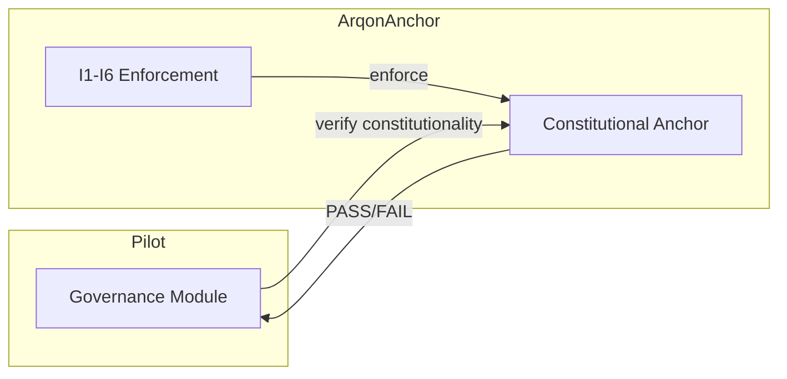
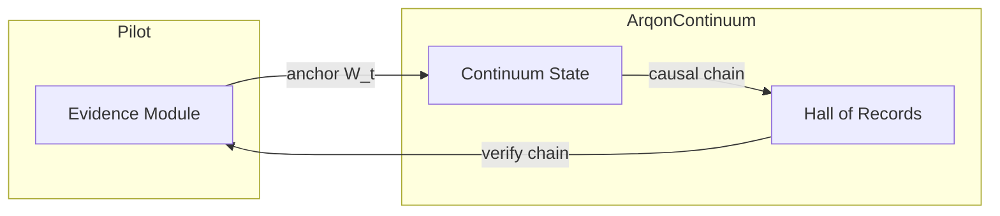
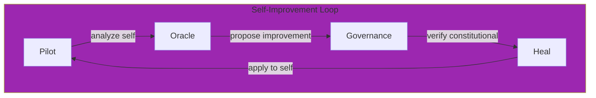
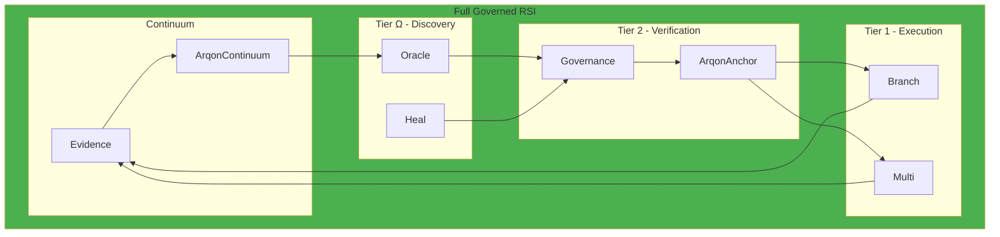

# Arqon Pilot Realignment Plan

**Version**: 1.0.0  
**Status**: Actionable Roadmap  
**Purpose**: Practical roadmap for realigning Pilot with its true purpose as the Governed RSI Engine

---

## Executive Summary

Pilot has drifted from its true identity. Currently positioned as a "DevSecOps control plane," it should be the **Governed RSI Engine**—the brain of the digital organism. This plan provides a phased approach to correct the framing, restore RSI semantics, and build toward autonomous evolution.

**The Core Truth**: CI/CD is the requirement, not the purpose. Pilot exists to enable safe, governed self-modification of the Arqon organism.

---

## 1. Current State Assessment

### What's Working (Mechanics Are Correct)

The underlying implementation is sound—the mechanics exist and function properly:

| Component | Status | RSI Alignment |
|-----------|--------|---------------|
| **Oracle** | ✅ Functional | Tier Ω - Discovery/Generator |
| **Heal** | ✅ Functional | Tier Ω - Discovery/Generator |
| **Governance** | ✅ Functional | Tier 2 - Verifier |
| **Branch** | ✅ Functional | Tier 1 - Executor |
| **Multi** | ✅ Functional | Tier 1 - Executor |
| **Evidence** | ✅ Functional | Continuum Anchoring |

**Key Insight**: The architecture already maps to RSI tiers. The problem is framing, not structure.

### What's Broken (Framing, Semantics, Terminology)

| Issue | Current State | Required State |
|-------|---------------|----------------|
| **Identity** | "DevSecOps control plane" | "Governed RSI Engine" |
| **Purpose** | CI/CD automation | Safe self-modification |
| **Commands** | "Running scripts" | Improvement Operators (A_t) |
| **Policy** | "Policy engine" | Constitutional verification |
| **Evidence** | "Logging/audit" | Continuum anchoring (W_t) |
| **Federation** | "Multi-repo support" | Organism coordination |

### What's Missing (RSI Layer, Constitutional Enforcement)

| Missing Element | RSI Requirement | Impact |
|-----------------|-----------------|--------|
| **Improvement Operator Type** | Formal A_t definition | Actions lack semantic weight |
| **Constitutional Invariants I1-I6** | Explicit enforcement | Safety is regulative, not constitutive |
| **Entropy Signatures** | Generator-Verifier Gap | No entropy tracking in provenance |
| **SAM Loop Closure** | S_t → M_t → A_t → W_t → S_{t+1} | Loop is implicit, not explicit |
| **Operator Training Arc** | Apprentice → Journeyman → Proxy | No capability progression model |

---

## 2. Realignment Phases

```mermaid
graph LR
    subgraph Phase1[Phase 1: Foundation]
        F1[Fix Framing]
        F2[Restore Terminology]
        F3[Connect Modules to Tiers]
    end
    
    subgraph Phase2[Phase 2: Semantic Layer]
        S1[Improvement Operator Type]
        S2[Constitutional Invariants]
        S3[Entropy Signatures]
    end
    
    subgraph Phase3[Phase 3: Integration]
        I1[ArqonAnchor Connection]
        I2[ArqonContinuum Connection]
        I3[SAM Loop Closure]
    end
    
    subgraph Phase4[Phase 4: Autonomous Evolution]
        A1[Self-Improvement]
        A2[Operator Training Arc]
        A3[Full Governed RSI]
    end
    
    Phase1 --> Phase2
    Phase2 --> Phase3
    Phase3 --> Phase4
    
    style Phase1 fill:#4caf50
    style Phase2 fill:#2196f3
    style Phase3 fill:#ff9800
    style Phase4 fill:#9c27b0
```



---

## Phase 1: Foundation (Immediate)

**Objective**: Fix the framing in all documentation and restore RSI terminology.

### 1.1 Documentation Audit and Correction

| Action | Why It Matters | Validation |
|--------|----------------|------------|
| Audit all docs for "CI/CD tool" framing | Prevents category error drift | Grep for "CI/CD tool" returns zero matches in identity contexts |
| Replace "policy engine" with "constitutional verification" | Restores semantic weight | All governance docs use constitutional language |
| Replace "logging" with "continuum anchoring" | Connects to W_t semantics | Evidence docs reference W_t and causal chains |
| Replace "multi-repo" with "federation/organism coordination" | Connects to AGOrg scope | Federation docs use organism metaphor |

### 1.2 Terminology Restoration

| Current Term | Restored Term | Files to Update |
|--------------|---------------|-----------------|
| "Command" | "Improvement Operator (A_t)" | All command docs |
| "Policy check" | "Constitutional verification" | Governance docs |
| "Execute" | "State transition (S_t → S_{t+1})" | Execution docs |
| "Evidence bundle" | "Witness (W_t)" | Evidence docs |
| "Preview" | "Constitutional pre-verification" | Preview docs |

### 1.3 Module-Tier Mapping Documentation

Create explicit documentation connecting each module to its RSI tier:

```markdown
## Module: Oracle
- **RSI Tier**: Ω (Discovery/Operator)
- **Entropy**: High
- **Role**: Generates improvement proposals
- **SAM Position**: M_t → A_t
- **Constitutional Interaction**: Submits to Tier 2, receives PASS/FAIL only
```

**Validation**: Every module has a tier mapping document.

### 1.4 Priority Actions for Phase 1

- [ ] **P1-A1**: Run terminology audit across all `.md` files in `docs/`
- [ ] **P1-A2**: Update `README.md` with correct identity statement
- [ ] **P1-A3**: Create `docs/rsi-tiers.md` with module mappings
- [ ] **P1-A4**: Update `docs/governance-guide.md` with constitutional language
- [ ] **P1-A5**: Update `docs/federated-ci-program-plan.md` with RSI framing

---

## Phase 2: Semantic Layer (Short-term)

**Objective**: Add RSI semantic types and constitutional enforcement to the codebase.

### 2.1 Improvement Operator Type

Define a formal type for Improvement Operators:

```rust
/// An Improvement Operator (A_t) - a mathematically defined operation
/// on source code or system state that proposes a state transition.
pub struct ImprovementOperator {
    /// Unique identifier for this operator
    pub id: OperatorId,
    /// The tier that generated this operator (must be Ω)
    pub source_tier: Tier,
    /// The proposed state transition
    pub action: Action,
    /// Entropy signature of the generator
    pub entropy_signature: EntropySignature,
    /// Constitutional pre-check result
    pub pre_verification: Option<VerificationResult>,
}
```

**Validation**: All commands construct and pass ImprovementOperator types.

### 2.2 Constitutional Invariant Checks (I1-I6)

Implement explicit invariant enforcement:

| Invariant | Implementation Location | Enforcement |
|-----------|------------------------|-------------|
| **I1: Code Identity** | `pilot-secure` | Signature verification before execution |
| **I2: Capability Cap** | `pilot-core` | Manifest whitelist validation |
| **I3: Privilege Lock** | `pilot-secure` | Sandbox enforcement |
| **I4: Data Provenance** | `pilot` | Merkle anchor logging |
| **I5: Edge Defense** | `pilot-secure` | Network policy enforcement |
| **I6: Identity Anchor** | `pilot-core` | Core identity check |

```rust
/// Constitutional verification result
pub struct ConstitutionalVerification {
    /// I1: Code Identity check
    pub code_identity: InvariantResult,
    /// I2: Capability Cap check
    pub capability_cap: InvariantResult,
    /// I3: Privilege Lock check
    pub privilege_lock: InvariantResult,
    /// I4: Data Provenance check
    pub data_provenance: InvariantResult,
    /// I5: Edge Defense check
    pub edge_defense: InvariantResult,
    /// I6: Identity Anchor check
    pub identity_anchor: InvariantResult,
}

impl ConstitutionalVerification {
    pub fn is_constitutional(&self) -> bool {
        self.code_identity.passed()
            && self.capability_cap.passed()
            && self.privilege_lock.passed()
            && self.data_provenance.passed()
            && self.edge_defense.passed()
            && self.identity_anchor.passed()
    }
}
```

**Validation**: Governance module returns ConstitutionalVerification for every action.

### 2.3 Entropy Signatures in Provenance

Add entropy tracking to evidence bundles:

```rust
/// Entropy signature for generator-verifier gap enforcement
pub struct EntropySignature {
    /// Entropy level of the generator (Ω = High, 2 = Zero)
    pub generator_entropy: EntropyLevel,
    /// Timestamp of generation
    pub generated_at: DateTime<Utc>,
    /// Hash of the generator state (opaque to verifier)
    pub generator_fingerprint: Hash,
    /// Whether this action passed through the gap
    pub gap_crossed: bool,
}
```

**Validation**: Every evidence bundle includes entropy signature.

### 2.4 Priority Actions for Phase 2

- [ ] **P2-A1**: Define ImprovementOperator type in `pilot-core`
- [ ] **P2-A2**: Implement I1-I6 invariant checks in governance module
- [ ] **P2-A3**: Add EntropySignature to evidence schema
- [ ] **P2-A4**: Update all commands to construct ImprovementOperator instances
- [ ] **P2-A5**: Add constitutional verification to preview-first discipline

---

## Phase 3: Integration (Medium-term)

**Objective**: Connect Pilot to the broader Arqon ecosystem for full governance.

### 3.1 ArqonAnchor Integration

Connect to ArqonAnchor for constitutional verification:



**Integration Points**:
- Governance module delegates to ArqonAnchor for invariant verification
- Constitutional updates flow through Anchor to Pilot
- Evidence bundles reference Anchor attestations

### 3.2 ArqonContinuum Integration

Connect to ArqonContinuum for state anchoring:



**Integration Points**:
- Evidence bundles anchored to Continuum
- Causal chain verification through Hall of Records
- Replay capability through continuum traversal

### 3.3 SAM Loop Closure

Implement explicit SAM loop tracking:

```rust
/// SAM Loop state machine
pub struct SamLoop {
    /// Current state (S_t)
    pub current_state: SystemState,
    /// Model/Operator logic (M_t)
    pub model: OperatorModel,
    /// Proposed action (A_t)
    pub action: Option<ImprovementOperator>,
    /// Witness/evidence (W_t)
    pub witness: Option<EvidenceBundle>,
    /// Next state (S_{t+1})
    pub next_state: Option<SystemState>,
}

impl SamLoop {
    /// Execute one SAM cycle
    pub fn cycle(&mut self) -> Result<SamLoopResult, SamLoopError> {
        // M_t generates A_t
        self.action = Some(self.model.generate(&self.current_state)?);
        
        // Tier 2 verification (constitutional)
        let verification = self.verify_constitutional(self.action.as_ref().unwrap())?;
        
        if verification.is_constitutional() {
            // Apply A_t → S_{t+1}
            self.next_state = Some(self.apply(self.action.as_ref().unwrap())?);
            
            // Generate W_t
            self.witness = Some(self.generate_witness()?);
            
            // Anchor to continuum
            self.anchor_to_continuum(self.witness.as_ref().unwrap())?;
            
            // S_{t+1} becomes S_t
            self.current_state = self.next_state.take().unwrap();
            
            Ok(SamLoopResult::TransitionComplete)
        } else {
            // Reject and regenerate
            self.action = None;
            Ok(SamLoopResult::ActionRejected(verification))
        }
    }
}
```

**Validation**: Every state transition is tracked through SAM loop.

### 3.4 Priority Actions for Phase 3

- [ ] **P3-A1**: Define ArqonAnchor integration interface
- [ ] **P3-A2**: Implement ArqonContinuum anchoring protocol
- [ ] **P3-A3**: Implement SAM loop state machine
- [ ] **P3-A4**: Add causal chain verification to evidence replay
- [ ] **P3-A5**: Create integration tests for full governance loop

---

## Phase 4: Autonomous Evolution (Long-term)

**Objective**: Enable Pilot to improve itself under constitutional constraints.

### 4.1 Self-Improvement Capabilities



**Requirements**:
- Pilot can analyze its own codebase through Oracle
- Proposed improvements flow through same governance loop
- Constitutional invariants prevent self-harmful modifications
- Evidence of self-modification is anchored to continuum

### 4.2 Operator Training Arc

Define capability progression for operators:

| Level | Name | Capabilities | Constraints |
|-------|------|--------------|-------------|
| **0** | Apprentice | Proposes actions, human approval required | Cannot execute without human |
| **1** | Journeyman | Executes approved actions autonomously | Cannot modify governance rules |
| **2** | Proxy | Full autonomy within constitutional bounds | Cannot modify constitution itself |

```rust
/// Operator capability level
pub enum OperatorLevel {
    /// Level 0: Requires human approval for all actions
    Apprentice,
    /// Level 1: Can execute approved actions autonomously
    Journeyman,
    /// Level 2: Full autonomy within constitutional bounds
    Proxy,
}

impl OperatorLevel {
    pub fn can_execute_without_approval(&self) -> bool {
        matches!(self, OperatorLevel::Journeyman | OperatorLevel::Proxy)
    }
    
    pub fn can_modify_governance(&self) -> bool {
        false // No level can modify governance
    }
}
```

**Validation**: Operator level is checked before autonomous execution.

### 4.3 Full Governed RSI Implementation

Complete the vision:



### 4.4 Priority Actions for Phase 4

- [ ] **P4-A1**: Enable Oracle to analyze Pilot's own codebase
- [ ] **P4-A2**: Implement OperatorLevel capability checks
- [ ] **P4-A3**: Create self-improvement governance rules
- [ ] **P4-A4**: Implement constitutional protection against self-harmful modifications
- [ ] **P4-A5**: Create training arc progression tests

---

## 3. Priority Actions Summary

### Immediate (This Week)

| Priority | Action | Owner | Validation |
|----------|--------|-------|------------|
| **P0** | Update README.md identity statement | Any | Grep shows correct framing |
| **P0** | Audit docs for "CI/CD tool" framing | Any | Zero incorrect references |
| **P1** | Create RSI tier mapping doc | Any | All modules documented |

### Short-term (This Month)

| Priority | Action | Owner | Validation |
|----------|--------|-------|------------|
| **P1** | Define ImprovementOperator type | Code | Type exists in pilot-core |
| **P1** | Implement I1-I6 checks | Code | Governance returns ConstitutionalVerification |
| **P2** | Add entropy signatures | Code | Evidence includes EntropySignature |

### Medium-term (This Quarter)

| Priority | Action | Owner | Validation |
|----------|--------|-------|------------|
| **P2** | ArqonAnchor integration | Code | Integration tests pass |
| **P2** | ArqonContinuum integration | Code | Anchoring tests pass |
| **P3** | SAM loop implementation | Code | State transitions tracked |

### Long-term (This Year)

| Priority | Action | Owner | Validation |
|----------|--------|-------|------------|
| **P3** | Self-improvement capability | Code | Pilot can propose own improvements |
| **P3** | Operator training arc | Code | Levels enforced |
| **P4** | Full governed RSI | Code | End-to-end tests pass |

---

## 4. Success Metrics

### Alignment Checklist

Use this checklist to validate alignment at each phase:

#### Phase 1 Completion Criteria
- [ ] All documentation uses constitutive language
- [ ] No references to Pilot as "just a CI/CD tool"
- [ ] Every module has documented RSI tier mapping
- [ ] Governance docs reference constitutional verification

#### Phase 2 Completion Criteria
- [ ] ImprovementOperator type defined and used
- [ ] I1-I6 invariant checks implemented
- [ ] Entropy signatures in all evidence bundles
- [ ] Constitutional verification is binary (PASS/FAIL)

#### Phase 3 Completion Criteria
- [ ] ArqonAnchor integration functional
- [ ] ArqonContinuum anchoring operational
- [ ] SAM loop explicitly tracked
- [ ] Causal chain verification working

#### Phase 4 Completion Criteria
- [ ] Pilot can analyze its own codebase
- [ ] Operator levels enforced
- [ ] Self-improvement flows through governance
- [ ] Constitutional protection verified

### Feature Validation Criteria

Every new feature must pass this test:

```
1. Can you articulate how this helps Pilot function as the Governed RSI Engine?
2. Which tier does this feature belong to (Ω, 2, or 1)?
3. Does it maintain the Generator-Verifier Gap?
4. Does it flow through constitutional verification?
5. Is evidence designed into the feature?
```

If any answer is unclear, the feature may represent drift.

### Documentation Completeness

| Document | Required Content | Status |
|----------|------------------|--------|
| `README.md` | Correct identity statement | [ ] |
| `docs/vision.md` | North star definition | [x] |
| `docs/pilot_vision_alignment.md` | RSI framework | [x] |
| `docs/rsi-tiers.md` | Module-tier mapping | [ ] |
| `docs/governance-guide.md` | Constitutional language | [ ] |
| `docs/evidence-guide.md` | Continuum anchoring | [ ] |

---

## 5. Anti-Patterns to Avoid

Reference: [`vision.md`](vision.md) Section 8

### Anti-Pattern 1: Treating Pilot as "Just a CI/CD Tool"

**Symptoms**:
- Features discussed only in CI/CD terms
- No connection to RSI semantics
- Governance treated as bureaucracy
- Evidence treated as logging

**Correction**:
- Reframe all features in RSI terms
- Connect every feature to the SAM loop
- Use constitutive language

### Anti-Pattern 2: Building Features Without RSI Semantics

**Symptoms**:
- New modules that don't map to tiers
- Actions that bypass the governance loop
- Features that cannot articulate their RSI purpose

**Correction**:
- Map every module to a tier
- Ensure every action flows through verification
- Validate RSI purpose before implementation

### Anti-Pattern 3: Using Regulative Language

**Symptoms**:
- Documentation says "should not" instead of "cannot"
- Safety described as "checks" instead of "verification"
- Features described as "preventing" instead of "making impossible"

**Correction**:
- Audit documentation for regulative language
- Replace with constitutive alternatives
- Train on the distinction

### Anti-Pattern 4: Disconnecting Governance from Constitutional Enforcement

**Symptoms**:
- Policy checks that can be bypassed
- "Emergency" flags that skip verification
- Governance as advisory instead of mandatory

**Correction**:
- Governance is Tier 2, not optional
- No bypass mechanisms
- Constitutional enforcement is absolute

### Anti-Pattern 5: Evidence as Afterthought

**Symptoms**:
- Evidence added after implementation
- Evidence format inconsistent
- Evidence not anchored to continuum

**Correction**:
- Evidence is part of the SAM loop (W_t)
- Design evidence structure with every action
- Anchor to Hall of Records by design

---

## 6. Reference Documents

| Document | Location | Purpose |
|----------|----------|---------|
| **Vision Document** | [`vision.md`](vision.md) | The north star—definitive identity |
| **Vision Alignment** | [`pilot_vision_alignment.md`](pilot_vision_alignment.md) | Detailed RSI framework and tier definitions |
| **Governed RSI** | `../../Arqon/docs/rsi/governed_rsi.md` | RSI architecture and theory |
| **Operator Model** | `../../Arqon/docs/rsi/operator_model.md` | SAM loop formalization |
| **Entropy Wall** | `../../Arqon/docs/rsi/entropy_wall.md` | Generator-Verifier Gap |
| **Arqon Organism** | `../../Arqon/docs/polity/arqon_organism.md` | Organ system architecture |
| **Legacy CI/CD Plan** | [`project_plan_ci_cd_control_plane.md`](project_plan_ci_cd_control_plane.md) | Historical context |

---

## 7. Living Document Maintenance

This plan is a living document. Update it as:

1. **Phases complete**: Mark items done, add lessons learned
2. **New requirements emerge**: Add to appropriate phase
3. **Priorities shift**: Reorder actions within phases
4. **Blockers found**: Document and propose alternatives

### Update Protocol

```markdown
## Change Log

| Date | Version | Changes |
|------|---------|---------|
| 2026-03-05 | 1.0.0 | Initial plan creation |
```

---

## 8. Conclusion

Pilot is the **Governed RSI Engine**—the mechanism by which digital life safely modifies itself. This plan provides the roadmap to realign Pilot with this identity.

**The North Star**:

> "Pilot is the intelligent control plane that allows a digital organism to evolve autonomously while remaining safe, compliant, and governed."

Every action in this plan connects to this purpose. Every phase moves Pilot closer to autonomous evolution under constitutional constraints.

**When in doubt, ask**:

> "Does this help Pilot fulfill its role as the mechanism by which digital life safely modifies itself?"

The answer is the guide that prevents drift and ensures alignment with Pilot's true purpose.

---

*This document is the actionable roadmap for Arqon Pilot realignment. For identity and purpose questions, defer to [`vision.md`](vision.md).*
