# Post-Commit Routine Ultimate Redesign

This document proposes the next design for the Dashboard `Post-Commit Routine` panel in Arqon Pilot.

It is intended as a reviewable design brief, not a hard-close implementation contract.

Related references:

- [Pilot-for-Pilot Control Plane Contract](pilot-for-pilot-control-plane-contract.md)
- [PRODUCTIONIZE](PRODUCTIONIZE.md)
- [Pilot Vision Alignment](pilot_vision_alignment.md)
- [Operator Runbook](operator-runbook.md)

---

## 1. Why This Panel Matters

The current `Post-Commit Routine` is already moving in the right direction:

1. It is on the `Dashboard`, which is correct.
2. It gives a visible workflow with status chips.
3. It orchestrates real backend contracts instead of inventing a parallel pathway.
4. It provides remediation when a stage fails.

But it still behaves like a macro wrapper over older controls.

That is too small for what this panel actually is.

This panel is the primary control surface for governed self-modification after a commit. It is where the operator should be able to answer four questions without leaving the Dashboard:

1. Am I properly scoped and allowed to do this?
2. What exactly will happen if I run this routine?
3. Where is the system right now as the routine executes?
4. What changed, what evidence was emitted, and what should happen next?

The redesign should make the panel feel like the constitutional evolution deck of Pilot, not just a convenient launch button.

---

## 2. Design Philosophy

The redesign should match Pilot's actual philosophy rather than generic DevOps UI conventions.

### 2.1 Core Principles

1. `Dashboard` is central command.
2. Specialist tabs remain deep workspaces, not the primary place where operators must assemble the routine mentally.
3. Mutations must flow through governance.
4. Every high-impact operation must be legible, auditable, and replayable.
5. The interface should express macro-to-micro feedback, not hide it.

### 2.2 What This Means In Practice

The panel must be:

1. **Governed**
   - policy and guard verdicts are first-class outputs.
2. **Legible**
   - the operator should not need raw JSON to understand state.
3. **Deterministic**
   - the routine should resolve into a clear plan before mutation.
4. **Replayable**
   - artifacts, run ids, stage traces, and evidence links should persist.
5. **Compositional**
   - Dashboard orchestrates shared contracts; it does not bypass specialist tab logic.

---

## 3. Current State Assessment

### 3.1 What Is Working

The current panel already provides:

1. Policy-driven step ordering
2. Stage chips
3. Live timeline updates
4. Remediation CTA routing
5. CI and evidence integration

### 3.2 Current Structural Limits

The current panel still has several weaknesses:

1. It does not own all of its own inputs.
2. It relies on hidden cross-panel state, especially push branch and remote.
3. It does not expose the resolved plan before execution.
4. It does not sufficiently surface governance verdicts.
5. It compresses too much of the output into chips plus a text transcript.
6. It still leaks raw JSON as a primary fallback in some paths.
7. It does not yet behave like a reusable, memory-bearing macro.

### 3.3 Key Diagnosis

The visual rail is not the main problem.

The main problem is that the rail currently shows execution status, but not enough resolved truth:

1. resolved scope
2. resolved cohort
3. resolved policy
4. resolved mutation boundary
5. resolved evidence outputs

The redesign should make the rail more meaningful rather than simply more decorative.

---

## 4. North-Star Interaction Model

The redesigned panel should operate as a four-phase control loop.

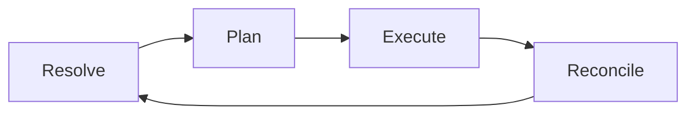

### 4.1 Resolve

Answer:

1. Which AGOrg is active?
2. Which repos are in scope?
3. Which policy profile applies?
4. Which guard rules apply?
5. Is mutation currently allowed?

### 4.2 Plan

Answer:

1. Which stages will run?
2. Which stages are preview-only?
3. Which stages mutate?
4. Which artifacts are expected?
5. What are the expected blocking conditions?

### 4.3 Execute

Answer:

1. Which stage is active?
2. What is the live status?
3. What is the current blocking or waiting reason?
4. Which external systems are in play?

### 4.4 Reconcile

Answer:

1. What changed?
2. What passed?
3. What failed or remained blocked?
4. What evidence was created?
5. What should the operator do next?

---

## 5. Proposed Workflow

### 5.1 User Workflow

The ideal operator flow should be:

1. Open `Dashboard`
2. Review resolved scope, cohort, policy, and plan
3. Choose run mode and toggles
4. Execute the routine
5. Drill into a stage only when needed
6. Review final reconciliation and artifacts

The operator should no longer need to manually bounce:

1. `Multi` for selector confidence
2. `Dashboard` for gates
3. a separate area for push settings
4. a raw output pane for evidence confirmation

### 5.2 Proposed Routine Flow

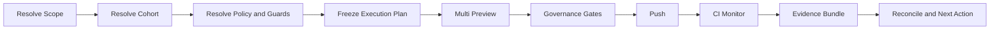

### 5.3 Mutation Boundaries

Every stage must be explicitly typed:

1. `resolve`
2. `preview`
3. `mutating`
4. `external`
5. `evidence`

This should be visible in the UI before the operator clicks `Run`.

---

## 6. Proposed Panel Anatomy

The panel should be redesigned as five layers.

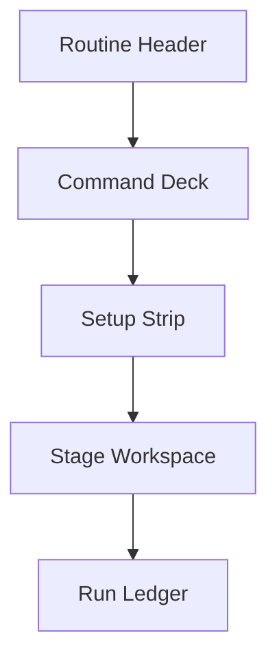

### 6.1 Routine Header

The header should show:

1. routine title
2. active AGOrg
3. active profile
4. current mode
5. last run result
6. last run timestamp

Purpose:

1. establish context immediately
2. make the panel feel like a persistent operational surface

### 6.2 Command Deck

Keep the horizontal chip rail, but upgrade it into the dominant navigation spine.

Proposed stages:

1. `Resolve`
2. `Plan`
3. `Multi`
4. `Gates`
5. `Push`
6. `CI`
7. `Evidence`
8. `Reconcile`

Each stage should support:

1. `idle`
2. `running`
3. `pass`
4. `warn`
5. `fail`
6. `blocked`
7. `skipped`
8. `off`

Clicking a stage should switch the Stage Workspace below.

### 6.3 Setup Strip

This area should own the routine's key inputs.

Proposed fields:

1. AGOrg selector or active-scope indicator
2. cohort selector
     - group
     - tags
     - optional saved cohort preset
3. push target
     - branch
     - remote
4. profile selector
5. mode selector
     - preview
     - safe execute
     - release execute
6. toggles
     - allow push
     - require evidence
     - stop on fail

This removes the current hidden dependency on external dashboard controls for branch and remote.

### 6.4 Stage Workspace

This is the most important new area.

Instead of only showing a timeline and transcript, the center of the panel should show the currently selected stage as a rich workspace.

Each stage workspace should contain:

1. plain-English stage summary
2. key metrics
3. dominant visualization
4. action controls
5. collapsed JSON/details section
6. artifact pointers
7. remediation if needed

### 6.5 Run Ledger

The existing timeline should evolve into a durable run ledger.

Each entry should show:

1. timestamp
2. stage
3. duration
4. result
5. one-line summary
6. artifact or run pointer
7. remediation if applicable

This remains a historical trace, not the primary live workspace.

---

## 7. Accessibility And ARIA Contract

This panel should be designed as a first-class accessible control surface, not visually rich UI with accessibility added later.

### 7.1 Accessibility Goals

The panel must support:

1. full keyboard-only operation
2. screen-reader comprehension without relying on color
3. clear focus management during execution and failure
4. live announcement of stage changes
5. plain-language summaries for all major state transitions

### 7.2 Semantic Structure

Recommended landmark and widget structure:

1. outer container: `section` with accessible heading
2. command deck: `tablist`
3. stage chips: `tab`
4. stage workspace panels: `tabpanel`
5. run ledger: `log`
6. critical error or hard block summary: `alert`
7. stage progress announcements: `status` or `aria-live="polite"`

### 7.3 Command Deck ARIA Model

The command deck should behave like a stage navigator, not decorative chips.

Recommended semantics:

1. command deck row uses `role="tablist"`
2. each stage chip uses `role="tab"`
3. active stage chip uses `aria-selected="true"`
4. each chip points to its stage workspace via `aria-controls`
5. each workspace uses `role="tabpanel"` and `aria-labelledby`

This makes stage switching understandable to assistive technology.

### 7.4 Live Announcements

The panel should maintain a dedicated announcer region for state changes.

Recommended announcement events:

1. routine resolved successfully
2. routine blocked by governance
3. stage started
4. stage passed
5. stage failed
6. stage skipped
7. final reconciliation complete

Suggested behavior:

1. normal state changes use `aria-live="polite"`
2. blocking failures use `aria-live="assertive"`

### 7.5 Focus Management

Focus behavior should be deterministic.

Recommended rules:

1. after clicking `Run`, focus remains on the run button unless a hard validation failure occurs
2. if the routine is blocked before execution, focus moves to the blocking summary
3. if a stage fails, focus moves to the remediation action region
4. if a user selects a stage chip, focus moves to the corresponding stage heading
5. if a run completes successfully, focus moves to the `Reconcile` heading or final summary

### 7.6 Non-Color Encoding

State must never be encoded only by color.

Every stage chip and stage card should expose:

1. text label
2. explicit state word
3. icon or glyph
4. optional short cause text for `warn`, `fail`, and `blocked`

Examples:

1. `Push: blocked`
2. `CI: running`
3. `Evidence: pass`

### 7.7 Keyboard Interaction

The redesigned panel should support:

1. `Tab` and `Shift+Tab` for normal traversal
2. arrow-key movement across stage chips
3. `Enter` or `Space` to activate a stage chip
4. `Home` and `End` to jump to first or last stage chip
5. `Escape` to collapse details drawers when applicable

### 7.8 Tables, Graphs, And Visuals

The stage workspace will include richer visuals, so each visual should have an accessibility fallback.

Requirements:

1. cohort table remains a real semantic table
2. DAG visual includes a text summary and accessible node count
3. PR plan is represented as a list or table, not only a graph
4. artifacts are exposed as standard links or buttons
5. charts and diagrams include plain-language captions

### 7.9 Accessibility Acceptance Criteria

This panel should not be considered complete until the operator can:

1. complete the routine keyboard-only
2. identify the active stage without sight
3. understand why a stage is blocked or failed via screen reader
4. review the final result without opening raw JSON
5. navigate from failure to remediation without pointer input

---

## 8. Wireframe And Proposed GUI

This section provides a reviewable wireframe of the proposed panel.

### 8.1 High-Level Wireframe

```text
+--------------------------------------------------------------------------------------------------+
| POST-COMMIT ROUTINE                                                     AGOrg: core / Profile:v3 |
| Mode: Safe Execute   Last Run: PASS 12m ago   Lineage: run_2026_03_06_001                       |
+--------------------------------------------------------------------------------------------------+
| [Resolve]---[Plan]---[Multi]---[Gates]---[Push]---[CI]---[Evidence]---[Reconcile]               |
|   PASS       PASS      ACTIVE      IDLE      IDLE    IDLE      IDLE          IDLE                |
+--------------------------------------------------------------------------------------------------+
| Setup Strip                                                                                      |
| Cohort: [group: core         ] [tags: pilot,ui      ] [preset: Pilot Core v]                    |
| Push:   [branch: main        ] [remote: origin      ]                                            |
| Profile:[operator_routine v3 ] Mode:[safe execute v ]                                            |
| [x] allow push   [x] require evidence   [x] stop on fail   [Preview Plan]   [Run Routine]       |
+--------------------------------------------------------------------------------------------------+
| Stage Workspace: Multi                                                                           |
| Summary: 4 repos matched. 3 clean. 1 ahead. 0 behind. PR plan available.                         |
|                                                                                                  |
| +-----------------------------------+  +------------------------------------------------------+  |
| | Cohort Summary                    |  | Dependency DAG                                       |  |
| | Selected repos: 4                 |  |  repo-a --> repo-b --> repo-d                       |  |
| | Clean: 3   Dirty: 1               |  |  repo-a --> repo-c                                  |  |
| | Ahead: 1   Behind: 0              |  |  Stage 1 | Stage 2 | Stage 3                        |  |
| +-----------------------------------+  +------------------------------------------------------+  |
|                                                                                                  |
| +----------------------------------------------------------------------------------------------+ |
| | Repo Cohort Table                                                                            | |
| | Repo      Branch   Clean   Ahead   Behind   Selected   Registered   Blockers                 | |
| | bus       main     yes     0       0        yes        yes          -                        | |
| | pilot     main     no      1       0        yes        yes          dirty tree               | |
| +----------------------------------------------------------------------------------------------+ |
|                                                                                                  |
| Actions: [Refresh Stage] [Open Multi] [View JSON] [Copy Summary]                                |
+--------------------------------------------------------------------------------------------------+
| Run Ledger                                                                                        |
| 15:42 Resolve    PASS     Active AGOrg and repo registration confirmed                           |
| 15:42 Plan       PASS     Frozen execution plan created                                          |
| 15:43 Multi      RUNNING  DAG and PR plan in progress                                            |
+--------------------------------------------------------------------------------------------------+
```

### 8.2 Mermaid Layout Sketch

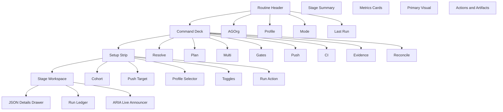

### 8.3 Stage Workspace Switch Model

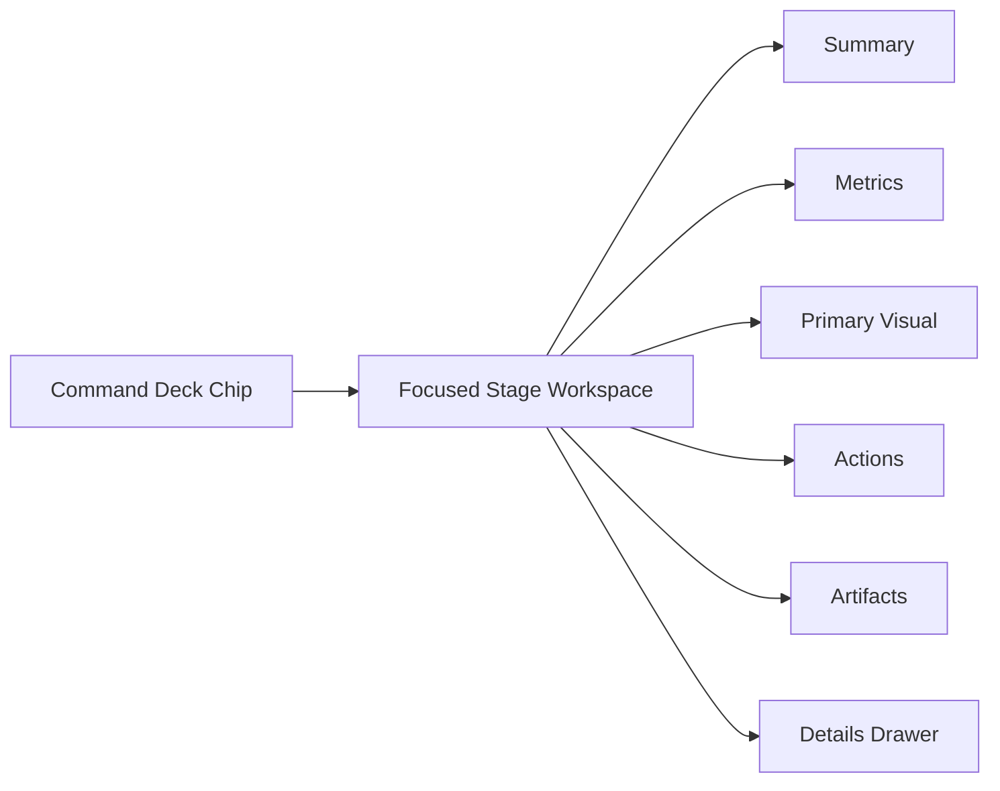

### 8.4 Accessibility Wireframe Notes

In the actual implementation:

1. the command deck should be keyboard-operable as a `tablist`
2. the stage workspace should update as a `tabpanel`
3. the run ledger should be a semantic live `log`
4. the blocking summary should be a visible and screen-readable `alert`
5. the final summary should be reachable with one keyboard action after run completion

---

## 9. Stage Workspace Requirements

### 9.1 Resolve Stage

The `Resolve` stage should show:

1. active AGOrg
2. cwd and whether it is inside active scope
3. registration status of current repo
4. branch cleanliness
5. resolved operator routine profile
6. guard readiness summary

Primary output:

1. `Ready`
2. `Ready with warnings`
3. `Blocked`

### 9.2 Plan Stage

The `Plan` stage should show:

1. exact ordered stage list
2. per-stage type: preview or mutating
3. per-stage expected outputs
4. per-stage expected artifacts
5. expected blocker conditions
6. dry-run lineage id if available

Primary output:

1. frozen execution plan

### 9.3 Multi Stage

The `Multi` stage should become highly visual.

It should show:

1. repo cohort table
2. DAG panel
3. PR plan panel
4. cohort summary chips

#### Cohort Table

Columns:

1. repo
2. group
3. tags
4. branch
5. clean
6. ahead
7. behind
8. selected
9. registered

#### DAG Panel

Show:

1. nodes by repo
2. edges by dependency
3. stage bands for execution order

#### PR Plan Panel

Show:

1. repo
2. head branch
3. base branch
4. dry-run PR order
5. blockers

### 9.4 Gates Stage

The `Gates` stage should stop being just a run transcript.

It should show a verdict matrix:

1. `Policy`
2. `Hook`
3. `Drift`
4. `Gate`

For each row:

1. status
2. failure code
3. summary
4. remediation
5. artifact pointer

### 9.5 Push Stage

The `Push` stage should show:

1. branch
2. remote
3. guard verdicts
4. mutation readiness
5. push result
6. emitted summary

This stage should clearly differentiate:

1. `blocked by governance`
2. `ready but not yet run`
3. `push failed operationally`
4. `push succeeded`

### 9.6 CI Stage

The `CI` stage should show:

1. workflow name
2. run URL
3. overall workflow state
4. job matrix
     - docs
     - rust
     - UI smoke
     - packaging
5. duration and polling status

### 9.7 Evidence Stage

The `Evidence` stage should show:

1. evidence artifact path
2. artifact existence state
3. signed or unsigned status
4. export summary
5. related run id

### 9.8 Reconcile Stage

This stage should answer the operator's actual end-of-run question.

Show:

1. what changed
2. what is now true
3. what remains unresolved
4. recommended next action
5. replay, inspect, or copy links

---

## 10. Inputs And Control Model

The redesigned panel should explicitly own its inputs.

### 10.1 User Inputs

The operator can set:

1. cohort selector
2. branch
3. remote
4. profile
5. run mode
6. allow push
7. require evidence
8. stop on fail override if policy allows it

### 10.2 Policy Inputs

Policy resolves:

1. stage order
2. governance requirements
3. allowed push branches
4. required pre-push steps
5. default push/evidence behavior

### 10.3 Runtime Inputs

The system resolves:

1. active AGOrg
2. current repo path
3. registration state
4. worktree cleanliness
5. multi registry stats
6. CI status
7. artifact presence

### 10.4 Ownership Rule

If an input can materially change the behavior of the routine, it should be visible in the panel itself or surfaced as a resolved read-only field in the panel.

No silent cross-panel dependencies for high-impact behavior.

---

## 11. Outputs We Should Surface

The panel should produce three levels of output.

### 11.1 Immediate Stage Output

Per stage:

1. status
2. summary
3. key metrics
4. remediation
5. artifact pointer

### 11.2 Run-Level Output

Per run:

1. run id
2. profile used
3. cohort used
4. branch and remote used
5. final result
6. duration
7. evidence bundle

### 11.3 Memory Output

Persist and surface:

1. last successful run
2. last failed run
3. last evidence path
4. last CI run URL
5. diff from previous run

---

## 12. Visual Language Proposal

The current aesthetic is disciplined and should be preserved.

The redesign should improve hierarchy, meaning, and operational density rather than forcing a new visual identity.

### 12.1 Keep

1. dark control-plane aesthetic
2. luminous cyan accents
3. linear stage progression
4. restrained, technical feel

### 12.2 Improve

1. stronger hierarchy between control, execution, and evidence
2. clearer stage focus state
3. better distinction between blocked and failed
4. richer graph-based visuals in the stage workspace
5. more persistent memory of previous run state

### 12.3 State Semantics

Recommended visual semantics:

1. `idle`: neutral low-contrast
2. `running`: cyan with active motion
3. `pass`: green
4. `warn`: amber
5. `fail`: red
6. `blocked`: slate or violet with lock semantics
7. `skipped`: dim amber-gray
8. `off`: muted and hollow

### 12.4 Important Distinction

`blocked` is not the same as `failed`.

`blocked` means governance worked correctly and prevented an unsafe or disallowed operation.

That should feel intentional and respectable in the UI.

---

## 13. Command Deck Concept

The top rail should behave like a command spine rather than a row of passive chips.

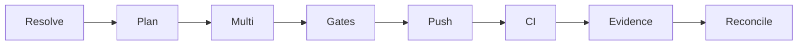

### 13.1 Chip Behavior

Each chip should support:

1. click to focus stage workspace
2. hover for summary tooltip
3. visible state iconography
4. connector line showing completed execution path

### 13.2 Connector Behavior

The line between chips should encode:

1. not reached
2. active path
3. completed path
4. blocked path

This makes the workflow legible at a glance.

---

## 14. Stage Data Contracts

The UI should adopt a stronger stage output model.

Recommended normalized shape:

```json
{
  "ok": true,
  "run_id": "uuid",
  "stage": "push",
  "status": "pass",
  "mode": "mutating",
  "summary": "Push to origin/main succeeded after all pre-push gates passed.",
  "metrics": {
    "repos_selected": 3,
    "repos_ready": 3
  },
  "artifacts": [
    {
      "kind": "ci_run",
      "label": "GitHub Actions",
      "uri": "https://..."
    }
  ],
  "remediation": [],
  "details": {}
}
```

The important requirement is not the exact JSON shape.

The important requirement is that every stage can drive the same rendering model:

1. summary
2. metrics
3. artifacts
4. remediation
5. details

---

## 15. Recommended Implementation Strategy

This should be implemented in two passes.

### 15.1 Pass 1: Structural Upgrade

Deliver:

1. own all major inputs in the panel
2. add `Resolve`, `Plan`, and `Reconcile`
3. add stage workspace below the rail
4. expose governance verdicts directly
5. expose cohort and artifact truth directly
6. keep current design language

### 15.2 Pass 2: Visual Upgrade

Deliver:

1. stronger command spine
2. richer multi-stage visuals
3. better visual hierarchy
4. persistent run memory
5. polished blocked/fail semantics

### 15.3 Non-Negotiables

1. do not duplicate backend logic across Dashboard and specialist tabs
2. do not bypass governance guards
3. do not regress current traceability
4. do not hide policy-derived behavior
5. do not make the panel depend on raw JSON for comprehension

---

## 16. Documentation Changes Needed

The docs should move from a manual tab-hopping flow to a routine-first flow.

### 16.1 Current Documentation Problem

Some current tutorial material still effectively teaches:

1. use `Multi`
2. use `Dashboard`
3. use push controls elsewhere
4. inspect outputs across multiple surfaces

That reflects the current implementation, but not the intended end state.

### 16.2 New Documentation Model

The primary docs should teach:

1. open Dashboard
2. review resolved plan
3. run routine
4. drill into stage if blocked or failed
5. review reconciliation and evidence

---

## 17. Open Questions For Review

These questions should be resolved before implementation hardens:

1. Should `Resolve` and `Plan` be separate chips, or should `Plan` be a sub-state inside `Resolve`?
2. Should the panel support saved cohort presets directly, or inherit them from `Multi`?
3. Should `Reconcile` be a first-class chip or a terminal summary mode?
4. Should CI remain inside the post-commit routine by default for all profiles?
5. Should evidence export be required by default for mutating runs?
6. What should be persisted across reload: only last run, or a short run history?
7. Should the command deck show lineage ids directly or only in the stage workspace?

---

## 18. Continuous Development And Continuous Integration Split

The redesigned Dashboard should explicitly separate `Continuous Development` from `Continuous Integration`.

The reason is structural:

1. the development lane is operator-driven, AGOrg-scoped, and locally governed
2. the integration lane is workflow-driven, externally executed, and dynamically discovered
3. these lanes are coupled, but they are not the same thing

### 18.1 Continuous Development Lane

This lane governs post-commit mutation readiness and operator-controlled progression.

Stages:

1. `Resolve`
2. `Plan`
3. `Multi`
4. `Gates`
5. `Push`
6. `Reconcile`

### 18.2 Continuous Integration Lane

This lane observes and evaluates remote workflow execution across the selected repo cohort.

It should not be hardcoded to a fixed list of jobs.

Instead, it should derive its model from:

1. discovered GitHub Actions workflows and jobs
2. effective policy requirements for the selected scope and cohort
3. current or recent workflow run state

### 18.3 Interaction Between The Two Lanes

The development lane produces:

1. the repo cohort
2. the branch intent
3. the mutation event
4. the evidence lineage

The integration lane consumes:

1. repo cohort
2. branch
3. workflow discovery
4. policy-required CI expectations
5. remote run status

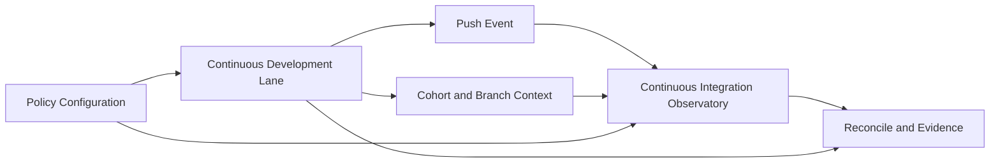

### 18.4 Layout Implication

The Dashboard should render:

1. a primary `Continuous Development` command deck
2. a dedicated `Continuous Integration Observatory` section immediately below or beside it

The CI observatory is not just one more chip in the CD rail.

It is its own live system view.

---

## 19. Continuous Integration Observatory

The `Continuous Integration Observatory` should be a dynamic section of the Dashboard that reflects the actual GitHub Actions reality of the selected cohort.

### 19.1 Why It Must Be Dynamic

Today the panel has hardcoded CI chips, but the correct model is:

1. workflows differ by repo
2. jobs differ by workflow
3. policy may require checks that are not currently configured
4. some workflows may be optional or informational

The UI should therefore distinguish:

1. discovered workflows
2. required workflows
3. running workflows
4. missing workflows
5. failing workflows

### 19.2 Observatory Views

The observatory should support four views.

#### A. Live Runs

Shows:

1. current runs across selected repos
2. queued, in-progress, completed, failed states
3. links to run URLs
4. association to current routine lineage if available

#### B. Policy Coverage

Shows:

1. required by policy
2. present in configuration
3. absent but required
4. configured but non-required
5. pass, warn, fail, missing

#### C. Workflow Catalog

Shows:

1. repo
2. workflow file
3. workflow display name
4. trigger types
5. jobs defined

#### D. Run Detail

Shows:

1. selected workflow run
2. job graph or matrix
3. duration
4. logs or log links
5. failure focus

### 19.3 Dynamic CI Data Model

The backend should normalize CI data for UI rendering.

Suggested fields:

1. `repo`
2. `workflow_id`
3. `workflow_name`
4. `workflow_path`
5. `job_name`
6. `status`
7. `conclusion`
8. `run_id`
9. `run_url`
10. `trigger`
11. `branch`
12. `required_by_policy`
13. `policy_source`
14. `missing_required_workflow`

### 19.4 CI Policy Interaction

The observatory should be policy-aware.

That means it should be able to answer:

1. which CI checks are required by current policy?
2. are they actually configured?
3. are they currently green?
4. if they are missing, is the system under-blocked?

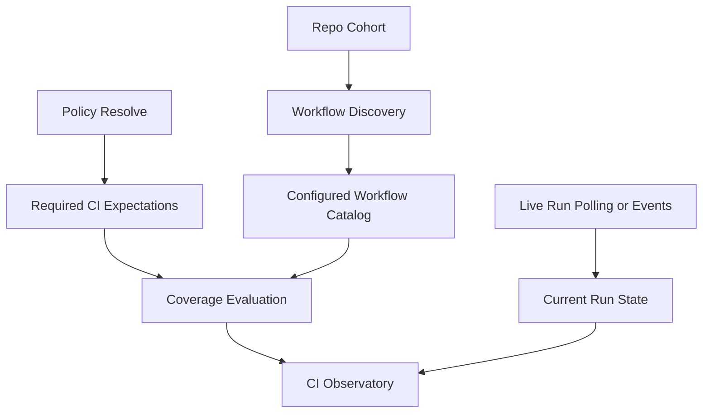

### 19.5 Proposed Observatory Layout

The CI section should contain:

1. top summary chips
   - running
   - required
   - missing
   - failing
2. workflow table
3. selected run detail panel
4. policy coverage panel

### 19.6 Accessibility Expectations

The CI observatory must support:

1. live screen-reader updates for run state changes
2. keyboard navigation across workflow rows
3. semantic tables for workflow coverage
4. explicit text for `missing required workflow`

---

## 20. Dashboard Policy Quick Edit Modal

The Dashboard should allow quick policy changes without forcing the operator to leave the control surface.

This should be implemented as a focused modal over the existing governance APIs, not as a duplicated settings subsystem.

### 20.1 Why A Modal Is Appropriate

The modal works because:

1. policy changes are high-signal, bounded actions
2. the operator often needs a small change, not a full settings workflow
3. the Dashboard already contains the operational context needed to preview policy impact

### 20.2 Modal Scope

The quick editor should initially support:

1. `operator_routine`
2. `dependency`
3. `release`

### 20.3 Modal Capabilities

The modal should support:

1. view active effective policy
2. edit a draft
3. simulate impact
4. activate draft
5. inspect version history
6. load a previous version
7. delete an exact version where allowed

### 20.4 Structured And JSON Editing

The modal should support two modes:

1. structured form for common fields
2. raw JSON editor for full control

The structured form should cover the fields most likely to be changed during routine tuning:

1. step order
2. stop-on-fail
3. push enabled
4. evidence enabled
5. required pre-push steps
6. allowed push branches
7. CI-required workflows or classes of workflows

### 20.5 Dashboard-Native Impact Preview

This is the most important feature.

The modal should simulate policy effects on the currently selected Dashboard context:

1. active AGOrg
2. current repo
3. selected cohort
4. current branch
5. current routine profile

This gives immediate macro-to-micro feedback.

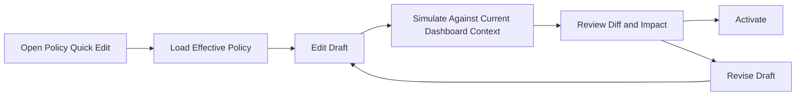

### 20.6 Modal Views

The modal should provide these tabs or subviews:

1. `Active`
2. `Draft`
3. `Simulate`
4. `Versions`
5. `Diff`

### 20.7 Accessibility Requirements

The policy modal must:

1. use `role="dialog"` with `aria-modal="true"`
2. trap focus while open
3. return focus to the invoking control when closed
4. expose activation and simulation results via live regions
5. provide accessible labels for structured form fields

---

## 21. Futuristic Dependency DAG Spec

The dependency DAG should evolve from a utility visual into a signature systems display.

The goal is not style for its own sake.

The goal is to make topology, execution order, and governance constraints legible in one ambitious visual surface.

### 21.1 Visual Direction

The DAG should feel:

1. futuristic
2. dense
3. deliberate
4. operational
5. high-integrity

It should not feel like:

1. a default force-directed chart
2. a generic admin console network graph
3. an ornamental animation with little information density

### 21.2 Primary Encoding Dimensions

The DAG should encode:

1. repo identity
2. dependency edges
3. execution stage bands
4. selected versus excluded repos
5. clean versus dirty state
6. ahead versus behind state
7. blocked or constrained state
8. active focus
9. current execution pulse

### 21.3 Three DAG Modes

The workspace should support three DAG modes.

#### A. Topology Mode

Shows:

1. raw dependency structure
2. cohort membership
3. major hubs and leaves

#### B. Execution Plan Mode

Shows:

1. stage bands
2. planned order
3. PR dependency order
4. active path emphasis

#### C. Governance Overlay Mode

Shows:

1. blocked nodes
2. nodes missing required checks
3. policy-constrained transitions
4. warnings and exceptions

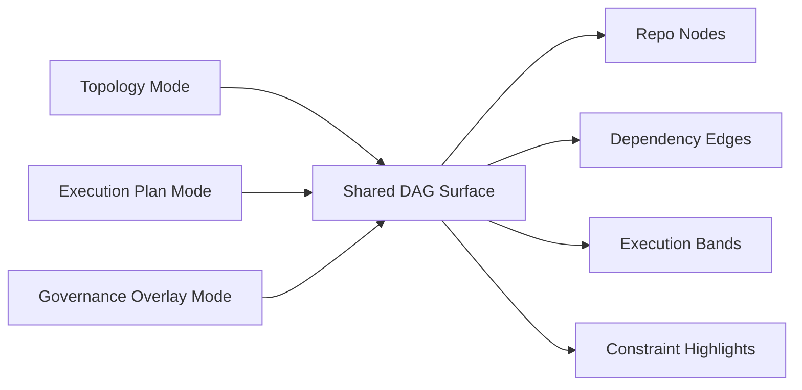

### 21.4 Node Design

Each repo node should support:

1. repo name
2. compact status glyphs
3. branch indicator
4. cleanliness indicator
5. selection state
6. focus state

### 21.5 Edge Design

Edges should support:

1. normal dependency traces
2. active execution pulse
3. blocked transition styling
4. muted styling for out-of-scope repos

### 21.6 Stage Bands

Execution order should be rendered as visible bands or rails behind the graph.

This gives the visual a more designed, futuristic look and helps the operator understand planned sequencing immediately.

### 21.7 Motion Guidance

Motion should be sparse and meaningful:

1. active edge pulse during planning and execution
2. node glow for active selection
3. subtle state transition animations

Avoid:

1. constant floating motion
2. noisy particle effects
3. decorative motion that obscures state

### 21.8 Accessibility Requirements

Because the DAG is visually ambitious, it must also expose:

1. a text summary of node and edge counts
2. a table fallback
3. keyboard-selectable repo list synchronized to graph focus
4. captions for mode changes and highlighted constraints

---

## 22. Information Architecture Revision

The redesign now implies a revised Dashboard architecture for this area.

### 22.1 Proposed Information Architecture

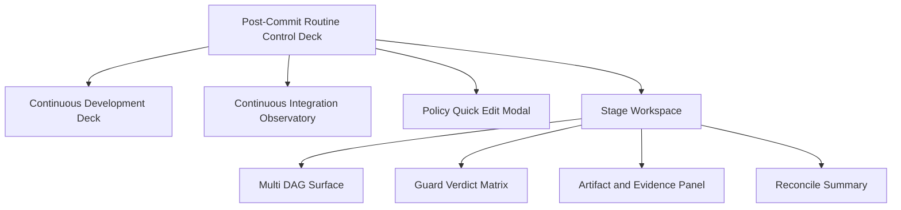

### 22.2 Surface Responsibilities

#### A. Continuous Development Deck

Responsible for:

1. mutation readiness
2. operator progression
3. AGOrg-scoped control flow

#### B. Continuous Integration Observatory

Responsible for:

1. workflow discovery
2. run monitoring
3. policy coverage visibility

#### C. Policy Quick Edit Modal

Responsible for:

1. local policy iteration
2. simulation
3. activation and version navigation

#### D. Stage Workspace

Responsible for:

1. deep understanding of the currently selected stage
2. primary visuals
3. artifacts
4. remediation

### 22.3 Result

This architecture preserves the Dashboard as central command while keeping specialist-tab logic shared and authoritative.

It also gives the operator:

1. one place to drive development progression
2. one place to monitor integration truth
3. one place to adjust policy safely
4. one place to understand topology and constraints

---

## 23. Frozen Policy And Gotcha Discipline

This redesign must obey the repo's frozen runtime policy and operational learning discipline.

### 23.1 Frozen Versions (Non-Negotiable)

The Dashboard redesign must not drift from the established pinned lanes:

1. core lane Rust/Cargo: `1.82.0`
2. packaging lane Rust: `1.88.0`
3. protobuf: `4.25.8`
4. `protoc`: `25.8`
5. source of truth: `scripts/frozen_versions.sh`

This means:

1. no design or implementation choice should assume casual toolchain bumps
2. CI observability must understand frozen-lane semantics
3. policy editing must not imply or encourage silent version drift
4. the observatory and reconciliation surfaces should be able to highlight frozen-lane violations explicitly

### 23.2 Gotcha Discipline

The redesign must preserve the working discipline already established in the repo:

1. when a new failure class is encountered, it must map to an existing gotcha or create a new gotcha entry in `docs/gotcha-registry.md`
2. docs, runbook guidance, and gotcha entries should be updated in the same iteration when behavior changes materially
3. success claims are incomplete if a discovered failure mode has not been recorded, bounded, and given a recovery path

### 23.3 Design Implication

The new control deck should make this discipline easier, not harder.

That means the UI should eventually surface:

1. failure signatures with stable identifiers
2. direct links or references to the gotcha registry
3. frozen-lane violations as first-class signals
4. remediation guidance that matches current docs and scripts

---

## 24. Gap Analysis: Current State vs Target State

The redesign should now be evaluated as a formal gap analysis rather than a list of disconnected improvements.

### 24.1 Gap Domains

The key domains are:

1. identity
2. control
3. observability
4. governance
5. intelligence
6. accessibility
7. operational discipline

### 24.2 Identity Gap

Current state:

1. the panel is still framed and implemented as a strong macro
2. it is clearly useful, but still reads as a feature card

Target state:

1. the panel is the governed evolution console for development and integration
2. it expresses Pilot's identity as a constitutional control deck

Gap severity:

1. high

Implication:

1. naming, layout hierarchy, and workflow semantics must reflect system identity, not just function execution

### 24.3 Control Gap

Current state:

1. the panel does not own all critical inputs
2. branch and remote still live elsewhere
3. some important context is implicit

Target state:

1. the panel owns or explicitly resolves every behavior-shaping input
2. there are no silent cross-panel dependencies for mutation-critical behavior

Gap severity:

1. high

Implication:

1. redesign the setup strip and resolved plan stage before adding visual polish

### 24.4 Observability Gap

Current state:

1. execution progress is visible
2. CI visibility exists, but in a hardcoded and limited form
3. evidence is present, but not well organized as a persistent observatory

Target state:

1. live local and remote truth are visible in one coherent surface
2. CI observatory is dynamic, policy-aware, and workflow-aware
3. artifacts, lineage, and previous runs are part of the normal operator view

Gap severity:

1. high

Implication:

1. CI must become its own observatory surface, not a single stage chip

### 24.5 Governance Gap

Current state:

1. governance strongly influences behavior
2. policy simulation and activation mostly live in Settings

Target state:

1. operators can inspect, simulate, diff, and activate policy changes from Dashboard context
2. policy impact on the current routine is visible before activation

Gap severity:

1. high

Implication:

1. add dashboard-native quick policy editing without duplicating governance logic

### 24.6 Intelligence Gap

Current state:

1. the DAG is useful but still mostly utilitarian
2. topology, execution order, and governance constraints are not unified in one visual language

Target state:

1. topology becomes a first-class intelligence surface
2. the operator can see structure, order, and constraint in one place

Gap severity:

1. medium-high

Implication:

1. the DAG should evolve into a signature visual system with mode overlays and synchronized textual fallbacks

### 24.7 Accessibility Gap

Current state:

1. the current UI already contains useful ARIA scaffolding
2. the panel is not yet designed around an explicit accessibility contract

Target state:

1. the control deck is operable and intelligible by keyboard and assistive technology
2. live progress, failures, and remediation are announced and navigable accessibly

Gap severity:

1. high

Implication:

1. accessibility must remain a first-order architectural requirement, not a pass applied after visuals

### 24.8 Operational Discipline Gap

Current state:

1. frozen versions and gotcha handling are documented elsewhere
2. the current panel does not yet expose these constraints directly

Target state:

1. frozen-lane drift and known gotcha signatures become visible operational concepts
2. the panel helps operators stay inside the actual production discipline of the project

Gap severity:

1. medium-high

Implication:

1. observability and reconciliation should explicitly reflect frozen-lane policy and known failure classes

---

## 25. Capability Matrix

The following matrix captures the current-to-target transition.

| Domain | Current Capability | Target Capability | Gap Severity | Notes |
|---|---|---|---|---|
| Identity | Strong macro card | Governed evolution console | High | This is a product-surface change, not a cosmetic change |
| Control | Partial ownership of inputs | Full ownership or explicit resolved inputs | High | Remove hidden branch/remote dependencies |
| CD Flow | Good linear routine | Full constitutional development deck | Medium | Existing rail is a strong base |
| CI | Hardcoded chip set | Dynamic CI observatory | High | Must derive from workflows + policy |
| Governance | Policy-driven behavior | Dashboard-native policy steering | High | Needs modal-based CRUD/simulate/diff |
| DAG | Useful utility visual | Futuristic intelligence workspace | Medium-High | Add topology/execution/governance modes |
| Evidence | Export and timeline present | Persistent memory and reconciliation surface | Medium-High | Artifacts should feel native, not secondary |
| Accessibility | Partial ARIA patterns | Full accessible control-deck contract | High | Must be designed in, not patched in |
| Operational Discipline | Documented in separate docs | Reflected inside control deck UX | Medium-High | Surface frozen lanes and gotchas |

### 25.1 Priority Interpretation

The highest-priority gaps are:

1. control
2. observability
3. governance
4. accessibility
5. identity

The panel should solve those before spending most effort on visual flourish.

---

## 26. Roadmap To Governed Evolution Console

The redesign should now be phased as a roadmap.

### 26.1 Phase A: Control Deck Foundation

Objective:

1. make the panel structurally correct

Deliver:

1. own all critical inputs in the panel
2. formalize `Resolve`, `Plan`, and `Reconcile`
3. add stage workspace
4. expose frozen execution plan before mutation
5. keep current command rail as the nucleus

Proof requirements:

1. operator can run full routine without tab hopping
2. all mutation-critical inputs are visible or resolved in-panel
3. no new hidden dependencies are introduced

### 26.2 Phase B: CI Observatory

Objective:

1. separate and strengthen integration observability

Deliver:

1. dynamic workflow discovery
2. policy coverage view
3. live run status
4. selected run detail panel
5. missing-required-workflow visibility

Proof requirements:

1. observatory reflects actual configured workflows, not hardcoded assumptions
2. required-by-policy vs configured is visible for the selected cohort
3. live workflow state is actionable from Dashboard

### 26.3 Phase C: Dashboard Policy Steering

Objective:

1. bring safe policy iteration into the Dashboard context

Deliver:

1. quick edit modal
2. structured and JSON editing
3. simulation and diff
4. activate and version navigation
5. impact preview against current dashboard context

Proof requirements:

1. no duplicated governance logic
2. policy impact preview matches backend resolution behavior
3. activation produces traceable decision and version history

### 26.4 Phase D: Intelligence Workspace

Objective:

1. turn the DAG and stage workspace into a signature intelligence surface

Deliver:

1. topology mode
2. execution plan mode
3. governance overlay mode
4. futuristic visual treatment with accessible fallback
5. synchronized table and graph views

Proof requirements:

1. graph meaningfully improves operator understanding
2. accessibility fallback remains complete
3. topology, order, and constraints are all legible

### 26.5 Phase E: Operational Memory And Discipline

Objective:

1. integrate replayability, frozen-lane awareness, and gotcha discipline into the control deck

Deliver:

1. persistent run memory
2. lineage and artifact continuity
3. frozen-version drift indicators
4. gotcha-aware remediation references
5. reconciliation output that ties state, evidence, and next action together

Proof requirements:

1. operator can explain what happened after a run without leaving Dashboard
2. new failure classes are easy to capture into the gotcha workflow
3. frozen-lane drift is surfaced before it becomes latent breakage

### 26.6 Execution Rule

The phases are not independent style exercises.

They should build in this order:

1. structure
2. observability
3. governance steering
4. intelligence visuals
5. operational memory

That ordering preserves correctness while still allowing the panel to become visually ambitious later.

---

## 27. Phase A Implementation Checklist

This section translates `Phase A: Control Deck Foundation` into concrete execution work.

### 27.1 Frontend Tasks

UI work in `crates/pilot/src/serve_ui.rs` and `crates/pilot/src/pilot_ui.js`:

1. replace the current routine card layout with:
   - routine header
   - command deck
   - setup strip
   - stage workspace
   - run ledger
2. move mutation-critical inputs into the panel itself:
   - cohort selector
   - branch
   - remote
   - mode
   - toggles
3. convert the command deck into an accessible stage navigator
4. add `Resolve`, `Plan`, and `Reconcile` stage workspaces
5. keep timeline data, but render it as a secondary ledger surface
6. preserve existing remediation CTA behavior while upgrading focus and announcement logic

### 27.2 Backend/API Tasks

Contract and backend work:

1. expose a resolved routine-plan payload for the active dashboard context
2. expose a normalized guard-verdict payload for the routine
3. expose a normalized cohort summary payload
4. preserve existing operator_routine policy resolution path
5. ensure no Dashboard path bypasses shared `Multi`, `Dependencies`, or governance contracts

### 27.3 Accessibility Tasks

Required accessibility implementation work:

1. command deck uses `tablist` / `tab` / `tabpanel`
2. live stage updates announce through dedicated live regions
3. failure and blocked summaries use `alert` semantics where appropriate
4. keyboard navigation supports arrow keys, home/end, enter/space
5. focus transitions are deterministic for run start, stage fail, and run completion

### 27.4 Testing Tasks

Phase A should include:

1. unit tests for state mapping and guard summary rendering
2. integration tests for resolved plan generation and blocking behavior
3. UI smoke coverage for the redesigned command deck
4. keyboard-only flow validation
5. regression checks for existing routine behavior and policy resolution

### 27.5 Documentation Tasks

Phase A docs work:

1. update `pilot-for-pilot-control-plane-contract.md` to reflect the new structure if implementation diverges from current contract wording
2. update `operator-runbook.md` and `tutorial/pilot-for-pilot-tutorial.md` to make Dashboard the primary routine surface
3. record new gotchas in `gotcha-registry.md` if redesign implementation exposes novel failure classes

---

## 28. CI Observatory Wireframe

This section gives a more detailed GUI sketch for the `Continuous Integration Observatory`.

### 28.1 ASCII Wireframe

```text
+--------------------------------------------------------------------------------------------------+
| CONTINUOUS INTEGRATION OBSERVATORY                                                               |
| Cohort: 4 repos   Branch: main   Policy Source: dependency v7   Last Refresh: 15:48             |
+--------------------------------------------------------------------------------------------------+
| [Live Runs] [Policy Coverage] [Workflow Catalog] [Run Detail]                                    |
+--------------------------------------------------------------------------------------------------+
| Summary Chips                                                                                    |
| Running: 2   Required: 6   Missing: 1   Failing: 1   Green: 4                                    |
+--------------------------------------------------------------------------------------------------+
| Workflow Table                                                                                   |
| Repo     Workflow             Trigger      Required   Status        Conclusion   Run URL          |
| pilot    ui-smoke             push         yes        in_progress   -            open             |
| pilot    docs-publish         push         no         completed     success      open             |
| bus      rust-gate            pull_request yes        completed     failure      open             |
| studio   visual-regression    push         yes        missing       -            -                |
+--------------------------------------------------------------------------------------------------+
| Selected Run Detail                                                                              |
| Workflow: ui-smoke                                                                               |
| Repo: pilot                     Run: #1824                     Trigger: push                     |
| Jobs:                                                                                           |
|  - install toolchain      PASS                                                                    |
|  - install protoc         PASS                                                                    |
|  - build UI               RUNNING                                                                 |
|  - smoke check            QUEUED                                                                  |
| Actions: [Open Run] [Copy Summary] [View Policy Coverage]                                        |
+--------------------------------------------------------------------------------------------------+
| Coverage Notes                                                                                   |
| Missing required workflow: studio / visual-regression                                            |
| Remediation: configure required workflow or update effective CI policy.                           |
+--------------------------------------------------------------------------------------------------+
```

### 28.2 Mermaid Layout Sketch

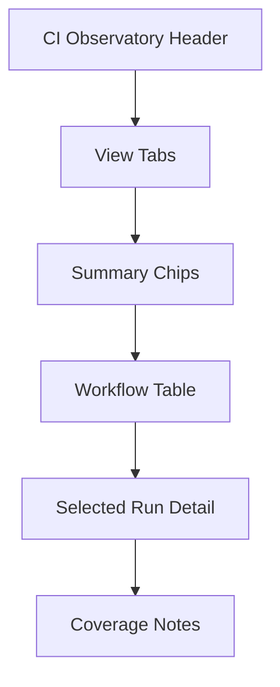

### 28.3 Accessibility Notes

The CI observatory should use:

1. semantic table markup for workflow rows
2. live `status` region for run state changes
3. keyboard-selectable table rows
4. explicit text for `missing required workflow`

---

## 29. Policy Quick Edit Modal Wireframe

This section gives a detailed sketch for the Dashboard policy modal.

### 29.1 ASCII Wireframe

```text
+----------------------------------------------------------------------------------------------+
| POLICY QUICK EDIT                                                               [Close]      |
| Kind: operator_routine    Source: AGOrg active v3    Target: current dashboard context       |
+----------------------------------------------------------------------------------------------+
| [Active] [Draft] [Simulate] [Versions] [Diff]                                                |
+----------------------------------------------------------------------------------------------+
| Active Policy Summary                                                                        |
| Step Order: Resolve -> Plan -> Multi -> Gates -> Push -> Reconcile                           |
| Push Enabled: yes      Evidence Required: yes      Stop on Fail: yes                          |
| Allowed Branches: main, dev                                                                   |
+----------------------------------------------------------------------------------------------+
| Draft Editor                                                                                 |
| Structured Fields:                                                                           |
|  Step Order      [Resolve,Plan,Multi,Gates,Push,Reconcile              ]                     |
|  Push Enabled    [x]                                                                         |
|  Evidence        [x]                                                                         |
|  Stop on Fail    [x]                                                                         |
|  Allowed Branches[main,dev                                          ]                         |
|  Required CI     [ui-smoke,rust-gate,docs-publish                    ]                        |
|                                                                                              |
| Raw JSON: [ Show / Hide ]                                                                    |
+----------------------------------------------------------------------------------------------+
| Simulation Result                                                                            |
| Current cohort impact: 4 repos                                                               |
| Newly blocked: 1 repo                                                                        |
| Missing required workflows: 1                                                                |
| Push to current branch: allowed                                                              |
| Actions: [Simulate] [Activate Draft] [Load Version] [Copy Diff]                              |
+----------------------------------------------------------------------------------------------+
```

### 29.2 Mermaid Layout Sketch

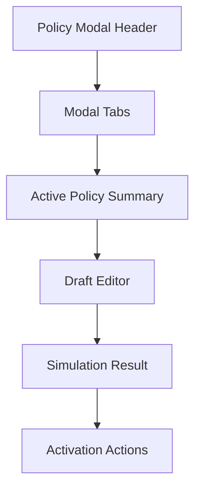

### 29.3 Accessibility Notes

The modal should:

1. use `role="dialog"` and `aria-modal="true"`
2. trap focus while open
3. restore focus to the invoking control when dismissed
4. expose simulation results in a live region
5. keep structured fields properly labeled and grouped

---

## 30. Implementation Backlog Mapping

This section maps the redesign to concrete code surfaces and contract work so the implementation can be executed without re-deriving scope.

### 30.1 Current Frontend Surfaces

The current routine implementation lives primarily in:

1. `crates/pilot/src/serve_ui.rs`
   - dashboard markup
   - current Post-Commit Routine card
   - current release routine card
2. `crates/pilot/src/pilot_ui.js`
   - routine orchestration
   - timeline rendering
   - chip state updates
   - CI refresh and evidence export calls

### 30.2 Existing API Surfaces To Reuse

These existing endpoints should be reused wherever possible:

1. `GET /api/agorg/active`
2. `GET /api/agorg/scope_snapshot`
3. `GET /api/multi/selectors`
4. `GET /api/multi/registry_stats`
5. `GET /api/multi/snapshot`
6. `POST /api/orchestrate/run`
7. `GET /api/orchestrate/timeline`
8. `POST /api/evidence/export`
9. `GET /api/settings/policy/:kind`
10. `POST /api/settings/policy/:kind/draft`
11. `POST /api/settings/policy/:kind/simulate`
12. `POST /api/settings/policy/:kind/activate`
13. `GET /api/settings/policy/:kind/versions`
14. `POST /api/settings/policy/:kind/load_version`
15. `POST /api/settings/policy/resolve`
16. `POST /api/settings/policy/resolve_trace`

### 30.3 Likely New API Surfaces

The redesign likely needs a small set of new normalized endpoints rather than many ad hoc UI calls.

Recommended additions:

1. `GET /api/dashboard/routine/resolve`
   - resolved AGOrg
   - resolved cohort
   - resolved routine profile
   - guard summary
2. `POST /api/dashboard/routine/plan`
   - normalized frozen execution plan
   - stage list
   - mutation boundaries
   - expected artifacts
3. `GET /api/dashboard/ci/catalog`
   - discovered workflow catalog for current cohort
4. `GET /api/dashboard/ci/runs`
   - current and recent workflow runs
5. `POST /api/dashboard/ci/coverage`
   - policy-required vs configured coverage analysis

### 30.4 Phase A File Map

#### A. `serve_ui.rs`

Primary tasks:

1. replace current routine card markup with the new stacked anatomy
2. add semantic regions for:
   - routine header
   - command deck
   - setup strip
   - stage workspace
   - run ledger
3. ensure ARIA roles are present at markup level
4. keep release routine separate unless explicitly merged later

#### B. `pilot_ui.js`

Primary tasks:

1. refactor routine state into explicit stage-workspace model
2. split CD deck state from CI observatory state
3. add stage selection and focus behavior
4. normalize rendering model for:
   - summary
   - metrics
   - artifacts
   - remediation
5. integrate live announcer and deterministic focus transitions

#### C. Governance/UI transport layer in `serve_ui.rs`

Primary tasks:

1. add any new dashboard-specific normalized endpoints
2. keep endpoint logic transport-only
3. delegate policy and guard resolution to governance layer

### 30.5 Phase B File Map

CI observatory implementation will likely touch:

1. `crates/pilot/src/serve_ui.rs`
   - new CI observatory routes if needed
2. `crates/pilot/src/pilot_ui.js`
   - dynamic observatory rendering
   - polling or event-driven updates
3. script-parsing or status-normalization helpers
4. possibly governance/policy model files if CI requirements become formal policy fields

### 30.6 Phase C File Map

Dashboard policy modal implementation will likely touch:

1. `crates/pilot/src/serve_ui.rs`
   - modal markup
   - modal trigger controls
2. `crates/pilot/src/pilot_ui.js`
   - modal state
   - draft load/save/simulate/activate flow
3. existing settings endpoints
   - should be reused, not duplicated

### 30.7 Phase D File Map

Intelligence workspace implementation will likely touch:

1. `crates/pilot/src/serve_ui.rs`
   - DAG workspace scaffolding
2. `crates/pilot/src/pilot_ui.js`
   - graph rendering and mode switching
   - synchronized graph/table focus model
3. `GET /api/multi/snapshot` or successor endpoints
   - should provide enough normalized data for topology and overlays

### 30.8 Testing Backlog

#### Frontend

1. stage navigation behavior
2. stage rendering by normalized payload
3. keyboard-only routine flow
4. modal focus trap and restore
5. CI observatory state transitions

#### Backend

1. resolved-plan payload correctness
2. policy-impact simulation correctness
3. CI catalog normalization correctness
4. coverage evaluation correctness

#### Integration

1. Dashboard routine uses same contracts as specialist tabs
2. policy quick-edit produces same results as Settings workflow
3. CI observatory respects current policy resolution and AGOrg scope

### 30.9 Documentation Backlog

When implementation begins, update these docs in lockstep:

1. `docs/pilot-for-pilot-control-plane-contract.md`
2. `docs/operator-runbook.md`
3. `docs/tutorial/pilot-for-pilot-tutorial.md`
4. `docs/release-playbook.md` if release routine interactions change
5. `docs/gotcha-registry.md` if new failure classes appear

### 30.10 Anti-Drift Rule

During implementation:

1. reuse existing authoritative endpoints before inventing new ones
2. add new endpoints only when they reduce UI complexity by normalizing data
3. do not fork governance behavior between Dashboard and Settings
4. do not fork CI semantics between Dashboard and scripts
5. update docs and gotchas in the same iteration when behavior changes

---

## 31. Proposed Outcome

If implemented well, this panel becomes:

1. the default post-commit operating surface
2. the clearest visible governance loop in the product
3. a reusable execution macro with memory
4. a more faithful embodiment of Pilot's identity as a governed RSI engine

That is the target.
