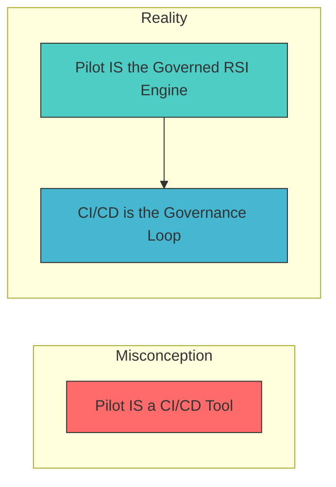
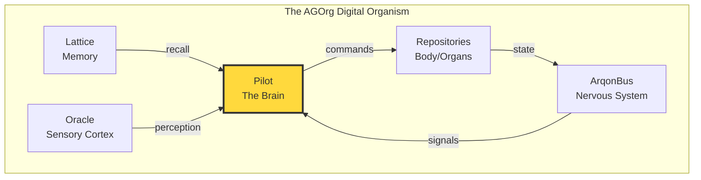
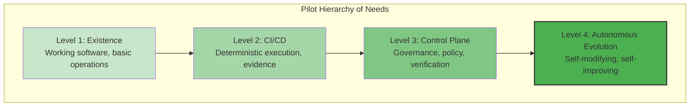
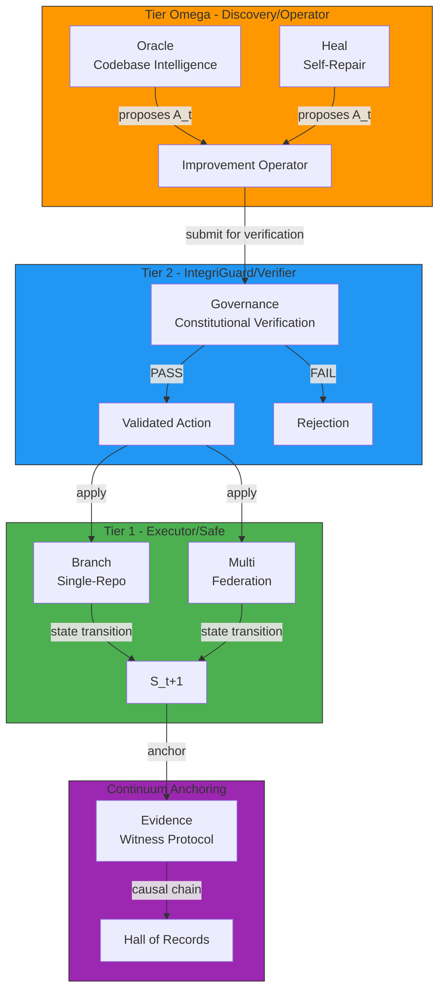
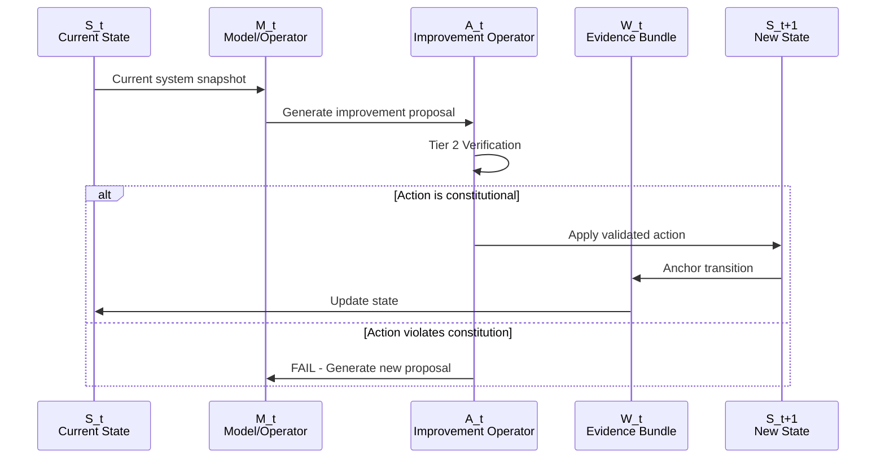
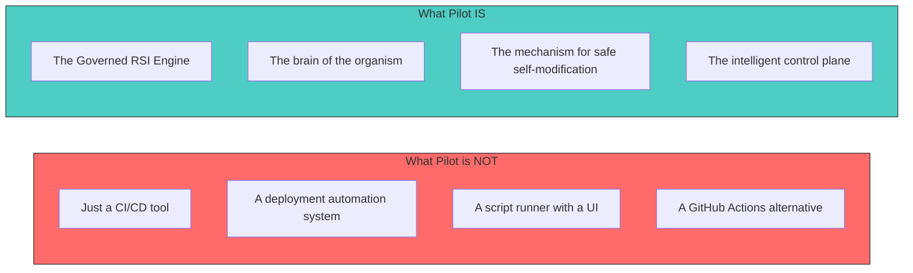

# Arqon Pilot Vision Document

**Version**: 1.0.0  
**Status**: Definitive North Star  
**Purpose**: The single source of truth for what Pilot IS and WHY it exists

---

## 1. Opening Statement: What Pilot IS

**Pilot is the intelligent control plane that allows a digital organism—the AGOrg ecosystem—to evolve autonomously while remaining safe, compliant, and governed.**

This is not aspirational language. This is ontological definition. Pilot is the mechanism by which digital life safely modifies itself.

Pilot is to Arqon as the brain is to a body: the central command that orchestrates growth, reconciles policy, and enables autonomous evolution without sacrificing constitutional integrity.

---

## 2. The Core Truth: CI/CD is the Requirement, Not the Purpose



**The Critical Distinction:**

| Misconception | Reality |
|---------------|---------|
| Pilot is a CI/CD tool | Pilot is the Governed RSI Engine |
| CI/CD is the purpose | CI/CD is the governance loop FOR RSI |
| Commands run scripts | Commands are Improvement Operators |
| Policy checks are bureaucracy | Policy checks are constitutional verification |
| Evidence is logging | Evidence is continuum anchoring |

Getting this wrong leads to feature drift, loss of RSI semantics, and a system that is "just another CI/CD tool."

Getting this right produces a system capable of **orchestrating autonomous evolution**.

---

## 3. The Biological Metaphor: Pilot as the Brain

### The Organism Analogy



**Pilot is to Arqon as the brain is to a body:**

| Biological Function | Pilot Equivalent |
|--------------------|------------------|
| **Executive Function** | Governance module—decides what actions are permitted |
| **Motor Control** | Branch/Multi modules—execute validated actions |
| **Sensory Processing** | Oracle module—perceives codebase state and opportunities |
| **Memory Formation** | Evidence module—anchors experiences to causal history |
| **Homeostasis** | Heal module—maintains system health |
| **Learning/Adaptation** | The SAM loop—state transitions that improve the organism |

### Why This Metaphor Matters

The biological metaphor is not mere poetry—it is architectural guidance:

1. **The brain does not micromanage every cell** — Pilot orchestrates at the right level of abstraction
2. **The brain protects the organism** — Pilot enforces constitutional invariants absolutely
3. **The brain enables adaptation** — Pilot allows the organism to evolve safely
4. **The brain integrates signals** — Pilot reconciles policy across the federation

---

## 4. The Hierarchy of Needs: From Existence to Autonomous Evolution



### Level 1: Existence
**Foundation**: Working software that executes commands reliably.

Without existence, nothing else matters. Pilot must be functional, stable, and usable.

### Level 2: CI/CD
**Capability**: Deterministic execution across local, CI, and release lanes.

This is the **requirement**—the governance loop that enables higher functions. But it is not the purpose.

### Level 3: Control Plane
**Intelligence**: Governance, policy reconciliation, constitutional verification.

This is where Pilot becomes more than a tool—it becomes the brain that decides, not just the hands that execute.

### Level 4: Autonomous Evolution
**Purpose**: Self-modifying, self-improving digital life.

This is the **goal**—a system that can safely improve itself while maintaining constitutional integrity.

**The Key Insight**: Most CI/CD tools operate at Level 2. Pilot exists to reach Level 4.

---

## 5. The Three Tiers: Architecture of Governed Change



### Tier Ω: Operator/Discovery — High Entropy

**Role**: Generates improvements. High creativity, high entropy. "Allowed to be crazy."

| Module | Function |
|--------|----------|
| **Oracle** | Codebase intelligence that discovers improvement opportunities |
| **Heal** | Self-repair mechanisms that propose fixes |

**Characteristics**:
- Proposes Improvement Operators (A_t)
- Explores solution space without constraint
- Never sees verifier internal state—only PASS/FAIL signal

### Tier 2: IntegriGuard/Verifier — Zero Entropy

**Role**: Verifies constitutionality. Zero creativity, zero entropy. Deterministic.

| Module | Function |
|--------|----------|
| **Governance** | Policy checks, constitutional verification |

**Characteristics**:
- Validates actions against Constitution
- Rejects any action that violates invariants
- The "Gap" that prevents model collapse

### Tier 1: Executor/Safe — Selection Function

**Role**: Applies validated changes. The selection function.

| Module | Function |
|--------|----------|
| **Branch** | Single-repo state transitions |
| **Multi** | Federated state transitions |

**Characteristics**:
- Applies A_t → S_{t+1}
- Only executes constitutionally verified actions
- Produces witness evidence

---

## 6. The SAM Loop: State Transition Model

```
S_t → M_t → A_t → W_t → S_{t+1}
```



**Definitions**:

| Symbol | Name | Meaning |
|--------|------|---------|
| **S_t** | State | The current system snapshot—source code, runtime memory, global truth |
| **M_t** | Model | The operator's current logic, defined by S_t |
| **A_t** | Action | The Improvement Operator—a mathematically defined operation on source code or system state |
| **W_t** | Witness | Cryptographic proof of transition effectiveness—the audit trail |
| **S_{t+1}** | New State | The resulting state after successful application |

**The Generator-Verifier Gap**:

The entity generating code (M_t) must be mathematically distinct from the entity verifying it (Tier 2). This prevents model collapse and forces grounding in external reality.

---

## 7. What This Means for Development

### Every Feature Must Connect to RSI Purpose

Before implementing any feature, validate:

```
Feature X → How does it help Pilot function as the Governed RSI Engine?
```

If the connection cannot be articulated in RSI terms, the feature may represent drift.

### Preview-First is Constitutional Verification

**NOT**: "Preview is a UX feature that shows what will happen"  
**IS**: "Preview is constitutional verification that ensures only valid states are generated"

The preview-first discipline makes forbidden states unrepresentable.

### Evidence is Continuum Anchoring

**NOT**: "Evidence is logging for debugging and auditing"  
**IS**: "Evidence is continuum anchoring that preserves causal history"

Evidence bundles are the W_t in the SAM loop—they anchor state transitions to the Hall of Records.

### Federation is Organism Coordination

**NOT**: "Federation is multi-repo support for convenience"  
**IS**: "Federation is organism coordination across the AGOrg"

Federated operations represent the organism acting on itself.

### Use Constitutive Language

| Avoid (Regulative) | Use (Constitutive) |
|--------------------|--------------------|
| "The system should not allow X" | "The system cannot represent X" |
| "We check for violations" | "We verify constitutionality" |
| "Logging for audit" | "Anchoring to continuum" |
| "Multi-repo support" | "Organism coordination" |

---

## 8. What Pilot is NOT

### Anti-Patterns to Avoid



| Anti-Pattern | Symptoms | Correction |
|--------------|----------|------------|
| **Treating Pilot as "just CI/CD"** | Features discussed only in CI/CD terms, no connection to RSI semantics | Reframe all features in RSI terms |
| **Building features without RSI semantics** | New modules that don't map to tiers, actions that bypass governance | Map every module to a tier |
| **Using regulative language** | Documentation says "should not" instead of "cannot" | Replace with constitutive alternatives |
| **Disconnecting governance from enforcement** | Policy checks that can be bypassed, "emergency" flags | Governance is Tier 2, not optional |
| **Evidence as afterthought** | Evidence added after implementation, inconsistent format | Evidence is part of the SAM loop by design |

---

## 9. The North Star

> **"Pilot is the intelligent control plane that allows a digital organism to evolve autonomously while remaining safe, compliant, and governed."**

When in doubt, return to this sentence. It is the definitive test for every decision, every feature, and every line of code.

**The Identity Test**:

Before implementing any feature, ask:

> "Does this help Pilot fulfill its role as the mechanism by which digital life safely modifies itself?"

If the answer is "it makes CI/CD easier" but cannot connect to RSI semantics, the feature may be drift.

---

## References

For deeper understanding, refer to these authoritative documents:

| Document | Purpose |
|----------|---------|
| [`pilot_vision_alignment.md`](pilot_vision_alignment.md) | Detailed RSI framework and tier definitions |
| `Arqon/docs/rsi/governed_rsi.md` | RSI architecture and theory |
| `Arqon/docs/rsi/operator_model.md` | SAM loop formalization |
| `Arqon/docs/rsi/entropy_wall.md` | Generator-Verifier Gap |
| `Arqon/docs/polity/arqon_organism.md` | Organ system architecture |
| `Arqon/docs/polity/vision_and_mission.md` | Arqon-wide vision |

---

*This document is the definitive north star for Arqon Pilot. When conflicts arise between this document and other documentation, this document takes precedence for matters of identity and purpose.*

---

**Remember**: Pilot is not building a system to dominate or replace—it is building a system to **enable safe, governed evolution**. Pilot is the brain that allows the digital organism to grow, adapt, and improve itself while remaining true to its constitutional identity.
